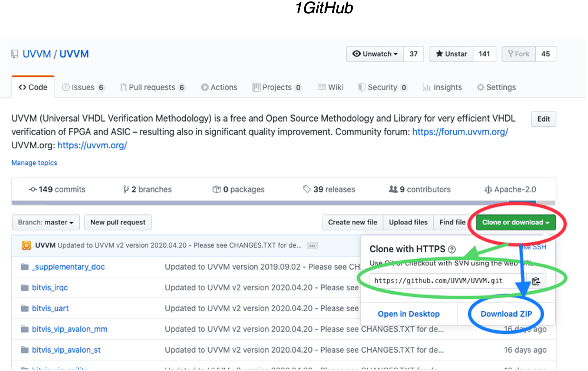
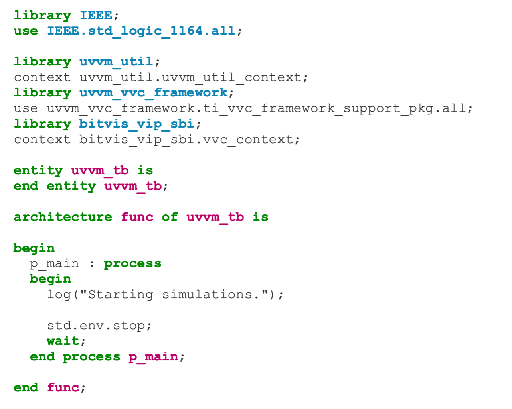
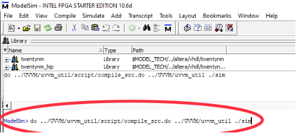

#######################################################################################################################
UVVM Getting Started
#######################################################################################################################

This is an introduction and step-by-step guide for beginning with UVVM, along with examples of common tasks that the
designers will have to carry out.

***********************************************************************************************************************	     
Introduction
***********************************************************************************************************************

UVVM (Universal VHDL Verification Methodology) is a free and open source methodology for making very structured
VHDL-based testbenches. UVVM has been released with two different complexity levels, a low complexity UVVM Light
repository with the Utility library and BFMs (Bus Functional Models), without advanced features such as VVCs and
command distribution system, and the complete UVVM repository with all features available.
The UVVM Light repository is a lightweight version of UVVM that can be used with simple testbenches and as a low-level
introduction to UVVM.
**Note** that UVVM and UVVM Light requires VHDL 2008 to compile.

***********************************************************************************************************************	     
Installation
***********************************************************************************************************************

UVVM can be downloaded as a zip file or cloned using git. We are continuously adding new features to UVVM and the
easiest way to receive the updates is by cloning UVVM with git.

#. Navigate to the UVVM repository on GitHub: https://github.com/UVVM/UVVM

#. Select “Clone or download” marked with a red circle:
   
   * Clone by copying the repository address (green circle) and from the project folder running the
     command: ``git clone https://github.com/UVVM/UVVM.git``
     
   * Or download everything as a zip (blue circle) and extract the downloaded file in the project folder.

#. After cloning or unzipping UVVM you have all that is needed to start using UVVM and all of its features with
   your testbench.

   
Updating UVVM
=============

The method for updating UVVM depends on the chosen installation method:

* **cloned using git:**
  run the following command in terminal inside the UVVM folder to receive the latest release changes: git pull

* **downloaded as a zip:**
  repeat step 2b in section 2 and replace the old UVVM version with the new downloaded version.
  Note that this will overwrite any local changes to UVVM, e.g. local changes in the adaptations_pkg.vhd

***********************************************************************************************************************	     
Testbench
***********************************************************************************************************************

Include ``uvvm_util_context`` and the VVCs or BFMs you will be using in your testbench to start using UVVM:

.. code-block:: vhdl
		
   library uvvm_util;
   context uvvm_util.uvvm_util_context;
   library uvvm_vvc_framework;
   use uvvm_vvc_framework.ti_vvc_framework_support_pkg.all;
   Library bitvis_vip_sbi;
   context bitvis_vip_sbi.vvc_context;

The context files will ensure that everything necessary are made available from within the testbench, e.g.
   

|  

***********************************************************************************************************************	     
Compilation
***********************************************************************************************************************
	  
UVVM can be compiled by calling the ``UVVM/script/compile_all.do`` file using simulator GUI or from the command line. 
This will compile all of UVVM. Each of the modules/VIPs in UVVM also have their own compilation scripts in a ``/script`` 
folder, e.g. for the SBI VIP ``bitvis_vip_sbi/script/compile_src.do``. The compile_src.do script can take two arguments, 
where the first argument is the module/VIP installation path and the second is the target path of the compilation,
i.e. ``compile_src.do <source_path> <target_path>``.

The following example of compiling UVVM from the command line and with Modelsim GUI have the following directory structure:

.. code-block:: console

  /UVVM 
    ...
    /bitvis_vip_sbi 
    /uvvm_util 
    /uvvm_vvc_framework

  /my_project 
    /sim
    /my_src 
    ...

and the vsim command / Modelsim GUI is run from the /my_project folder with the /sim folder as compilation target:

* Command line example for UVVM Utility Library compilation:
  
  ``$ vsim -c -do "do ../UVVM/uvvm_util/script/compile_src.do ../UVVM ./sim"``

* Modelsim GUI example:

.. note::
  ``../UVVM/uvvm_util/script/compile_src.do`` is the relative path to the ``compile_src.do`` script for the UVVM 
  Utility Library, ``../UVVM is`` the relative path to UVVM installation (source path), and ``./sim`` is the relative 
  path to the compilation target (target path).

***********************************************************************************************************************	     
Compilation Order
***********************************************************************************************************************
  
Most of the modules/VIPs have some dependencies, thus compilation has to be performed in a specific order. The 
compilation order of the source files for a module/VIP is listed in the ``script/compile_order.txt`` file and in 
the quick reference PDF in the /doc folder. The library dependencies, i.e. other modules/VIPs that needs to be 
compiled prior to compiling a particular module/VIP, is listed in the quick reference PDF of each module/VIP.

As a rule of thumb, every module/VIP have the following dependencies:

#. UVVM Utility Library
#. UVVM VVC Framework
#. Bitvis VIP Scoreboard (most of the VVCs have built in scoreboard functionality)

***********************************************************************************************************************
Further Reading
***********************************************************************************************************************

We recommend that everyone new to UVVM have a look at the Simple_TB_step_by_step.pps and 
``UVVM_Utility_Library_Concepts_and_Usage.pps`` power point presentations located in the ``UVVM/uvvm_util/doc`` folder. 
There are several other documents to explore and we recommend that you start reading those located in the 
``UVVM/uvvm_vvc_framework/doc`` folder when you feel ready to advance with the many features of UVVM.

We encourage the UVVM community to participate in the UVVM user forum with questions and discussions at 
https://forum.uvvm.org, and to visit the UVVM news site at https://uvvm.org.

