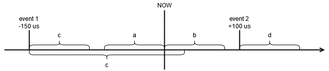

##################################################################################################################################
Bitvis VIP GPIO
##################################################################################################################################

**Quick Access**

* `BFM`_

  * :ref:`gpio_set_bfm`
  * :ref:`gpio_get_bfm`
  * :ref:`gpio_check_bfm`
  * :ref:`gpio_check_stable_bfm`
  * :ref:`gpio_expect_bfm`
  * :ref:`gpio_expect_stable_bfm`

* `VVC`_

  * :ref:`gpio_set_vvc`
  * :ref:`gpio_get_vvc`
  * :ref:`gpio_check_vvc`
  * :ref:`gpio_check_stable_vvc`
  * :ref:`gpio_expect_vvc`
  * :ref:`gpio_expect_stable_vvc`

.. include:: rst_snippets/subtitle_1_division.rst

**********************************************************************************************************************************
BFM
**********************************************************************************************************************************
BFM functionality is implemented in gpio_bfm_pkg.vhd

.. _t_gpio_bfm_config:

Configuration Record
==================================================================================================================================
**t_gpio_bfm_config**

Default value for the record is C_GPIO_BFM_CONFIG_DEFAULT.

+------------------------------+------------------------------+-----------------+-------------------------------------------------+
| Record element               | Type                         | Default         | Description                                     |
+==============================+==============================+=================+=================================================+
| clock_period                 | time                         | -1 ns           | Specifies the clock period                      |
+------------------------------+------------------------------+-----------------+-------------------------------------------------+
| match_strictness             | :ref:`t_match_strictness`    | MATCH_EXACT     | Matching strictness for std_logic values in     |
|                              |                              |                 | check procedures.                               |
|                              |                              |                 |                                                 |
|                              |                              |                 | MATCH_EXACT requires both values to be the      |
|                              |                              |                 | same. Note that the expected value can contain  |
|                              |                              |                 | the don't care operator '-'.                    |
|                              |                              |                 |                                                 |
|                              |                              |                 | MATCH_STD allows comparisons between 'H' and    |
|                              |                              |                 | '1', 'L' and '0' and '-' in both values.        |
+------------------------------+------------------------------+-----------------+-------------------------------------------------+
| id_for_bfm                   | t_msg_id                     | ID_BFM          | Message ID used for logging general messages in |
|                              |                              |                 | the BFM                                         |
+------------------------------+------------------------------+-----------------+-------------------------------------------------+
| id_for_bfm_wait              | t_msg_id                     | ID_BFM_WAIT     | DEPRECATED                                      |
+------------------------------+------------------------------+-----------------+-------------------------------------------------+
| timeout                      | time                         | -1 ns           | Timeout value for the expected procedures. This |
|                              |                              |                 | is only used if no timeout parameter is given   |
|                              |                              |                 | in the procedures.                              |
+------------------------------+------------------------------+-----------------+-------------------------------------------------+

Methods
==================================================================================================================================
* All signals are active high.
* All parameters in brackets are optional.

.. _gpio_set_bfm:

gpio_set()
----------------------------------------------------------------------------------------------------------------------------------
Writes the given data in 'data_value' to the DUT. When called, the procedure will write to the DUT register immediately, except 
bits set to "don't care" ('-').

.. code-block::

    gpio_set(data_value, msg, data_port, [scope, [msg_id_panel, [config]]])

+----------+--------------------+--------+------------------------------+---------------------------------------------------------+
| Object   | Name               | Dir.   | Type                         | Description                                             |
+==========+====================+========+==============================+=========================================================+
| constant | data_value         | in     | std_logic_vector             | The data value to be written to the DUT. This value is  |
|          |                    |        |                              | normalized to the data_port direction.                  |
+----------+--------------------+--------+------------------------------+---------------------------------------------------------+
| constant | msg                | in     | string                       | A custom message to be appended in the log/alert        |
+----------+--------------------+--------+------------------------------+---------------------------------------------------------+
| signal   | data_port          | inout  | std_logic_vector             | The signal where the data_value is written to           |
+----------+--------------------+--------+------------------------------+---------------------------------------------------------+
| constant | scope              | in     | string                       | Describes the scope from which the log/alert originates.|
|          |                    |        |                              | Default value is C_BFM_SCOPE ("GPIO BFM").              |
+----------+--------------------+--------+------------------------------+---------------------------------------------------------+
| constant | msg_id_panel       | in     | t_msg_id_panel               | Controls verbosity within a specified scope. Default    |
|          |                    |        |                              | value is shared_msg_id_panel.                           |
+----------+--------------------+--------+------------------------------+---------------------------------------------------------+
| constant | config             | in     | :ref:`t_gpio_bfm_config      | Configuration of BFM behavior and restrictions. Default |
|          |                    |        | <t_gpio_bfm_config>`         | value is C_GPIO_BFM_CONFIG_DEFAULT.                     |
+----------+--------------------+--------+------------------------------+---------------------------------------------------------+

.. code-block::

    -- Examples:
    gpio_set(C_BAUDRATE_9600, "Set baud-rate to 9600", data_port, C_SCOPE, shared_msg_id_panel, C_GPIO_BFM_CONFIG_DEFAULT);

    -- Suggested usage (requires local overload, see 'Local BFM overloads' section):
    gpio_set(C_BAUDRATE_9600, "Set baud-rate to 9600", data_port);

.. _gpio_get_bfm:

gpio_get()
----------------------------------------------------------------------------------------------------------------------------------
Reads data from the DUT.

.. code-block::

    gpio_get(data_value, msg, data_port, [scope, [msg_id_panel, [config]]])

+----------+--------------------+--------+------------------------------+---------------------------------------------------------+
| Object   | Name               | Dir.   | Type                         | Description                                             |
+==========+====================+========+==============================+=========================================================+
| variable | data_value         | out    | std_logic_vector             | The data value to be read from the DUT                  |
+----------+--------------------+--------+------------------------------+---------------------------------------------------------+
| constant | msg                | in     | string                       | A custom message to be appended in the log/alert        |
+----------+--------------------+--------+------------------------------+---------------------------------------------------------+
| signal   | data_port          | in     | std_logic_vector             | The signal where the data_value is written to           |
+----------+--------------------+--------+------------------------------+---------------------------------------------------------+
| constant | scope              | in     | string                       | Describes the scope from which the log/alert originates.|
|          |                    |        |                              | Default value is C_BFM_SCOPE ("GPIO BFM").              |
+----------+--------------------+--------+------------------------------+---------------------------------------------------------+
| constant | msg_id_panel       | in     | t_msg_id_panel               | Controls verbosity within a specified scope. Default    |
|          |                    |        |                              | value is shared_msg_id_panel.                           |
+----------+--------------------+--------+------------------------------+---------------------------------------------------------+
| constant | config             | in     | :ref:`t_gpio_bfm_config      | Configuration of BFM behavior and restrictions. Default |
|          |                    |        | <t_gpio_bfm_config>`         | value is C_GPIO_BFM_CONFIG_DEFAULT.                     |
+----------+--------------------+--------+------------------------------+---------------------------------------------------------+

.. code-block::

    -- Examples:
    gpio_get(v_baudrate, "Read baud-rate", data_port, C_SCOPE, shared_msg_id_panel, C_GPIO_BFM_CONFIG_DEFAULT);

    -- Suggested usage (requires local overload, see 'Local BFM overloads' section):
    gpio_set(v_baudrate, "Read baud-rate", data_port);

.. _gpio_check_bfm:

gpio_check()
----------------------------------------------------------------------------------------------------------------------------------
Reads the DUT register and compares the data with the expected data in 'data_exp'.

* If the read data matches the expected data, a log message is written with ID 'config.id_for_bfm'.
* If the read data did not match the expected data, an alert with severity 'alert_level' will be reported.
* Bits set to "don't care" ('-') will not be checked.

.. code-block::

    gpio_check(data_value, msg, data_port, [alert_level, [scope, [msg_id_panel, [config]]]])

+----------+--------------------+--------+------------------------------+---------------------------------------------------------+
| Object   | Name               | Dir.   | Type                         | Description                                             |
+==========+====================+========+==============================+=========================================================+
| constant | data_exp           | in     | std_logic_vector             | The data value to expect when reading the register.     |
|          |                    |        |                              | A mismatch results in an alert with severity            |
|          |                    |        |                              | 'alert_level'. This value is normalized to the data_port|
|          |                    |        |                              | direction.                                              |
+----------+--------------------+--------+------------------------------+---------------------------------------------------------+
| constant | msg                | in     | string                       | A custom message to be appended in the log/alert        |
+----------+--------------------+--------+------------------------------+---------------------------------------------------------+
| signal   | data_port          | in     | std_logic_vector             | The signal where the data_value is written to           |
+----------+--------------------+--------+------------------------------+---------------------------------------------------------+
| constant | alert_level        | in     | :ref:`t_alert_level`         | Sets the severity for the alert. Default value is ERROR.|
+----------+--------------------+--------+------------------------------+---------------------------------------------------------+
| constant | scope              | in     | string                       | Describes the scope from which the log/alert originates.|
|          |                    |        |                              | Default value is C_BFM_SCOPE ("GPIO BFM").              |
+----------+--------------------+--------+------------------------------+---------------------------------------------------------+
| constant | msg_id_panel       | in     | t_msg_id_panel               | Controls verbosity within a specified scope. Default    |
|          |                    |        |                              | value is shared_msg_id_panel.                           |
+----------+--------------------+--------+------------------------------+---------------------------------------------------------+
| constant | config             | in     | :ref:`t_gpio_bfm_config      | Configuration of BFM behavior and restrictions. Default |
|          |                    |        | <t_gpio_bfm_config>`         | value is C_GPIO_BFM_CONFIG_DEFAULT.                     |
+----------+--------------------+--------+------------------------------+---------------------------------------------------------+

.. code-block::

    -- Examples:
    gpio_check(x"3B", "Check data from UART RX", data_port, ERROR, C_SCOPE, shared_msg_id_panel, C_GPIO_BFM_CONFIG_DEFAULT);

    -- Suggested usage (requires local overload, see 'Local BFM overloads' section):
    gpio_check(x"3B", "Check data from UART RX", data_port);

.. _gpio_check_stable_bfm:

gpio_check_stable()
----------------------------------------------------------------------------------------------------------------------------------
Reads the DUT register and compares the data with the expected data in 'data_exp', it also checks that the DUT register has been 
stable for the 'stable_req' time (see :ref:`checking_stability`).

* If the read data matches the expected data and is stable, a log message is written with ID 'config.id_for_bfm'.
* If the read data did not match the expected data or is not stable, an alert with severity 'alert_level' will be reported.
* Bits set to "don't care" ('-') will not be checked.
* Note that it is not possible to use the "don't care" ('-') operator in 'data_exp' to ignore changes in a subset of a std_logic_vector.

.. code-block::

    gpio_check_stable(data_value, stable_req, msg, data_port, [alert_level, [scope, [msg_id_panel, [config]]]])

+----------+--------------------+--------+------------------------------+---------------------------------------------------------+
| Object   | Name               | Dir.   | Type                         | Description                                             |
+==========+====================+========+==============================+=========================================================+
| constant | data_exp           | in     | std_logic_vector             | The data value to expect when reading the register.     |
|          |                    |        |                              | A mismatch results in an alert with severity            |
|          |                    |        |                              | 'alert_level'. This value is normalized to the data_port|
|          |                    |        |                              | direction.                                              |
+----------+--------------------+--------+------------------------------+---------------------------------------------------------+
| constant | stable_req         | in     | time                         | The time that the expected data value should remain     |
|          |                    |        |                              | stable in the register                                  |
+----------+--------------------+--------+------------------------------+---------------------------------------------------------+
| constant | msg                | in     | string                       | A custom message to be appended in the log/alert        |
+----------+--------------------+--------+------------------------------+---------------------------------------------------------+
| signal   | data_port          | in     | std_logic_vector             | The signal where the data_value is written to           |
+----------+--------------------+--------+------------------------------+---------------------------------------------------------+
| constant | alert_level        | in     | :ref:`t_alert_level`         | Sets the severity for the alert. Default value is ERROR.|
+----------+--------------------+--------+------------------------------+---------------------------------------------------------+
| constant | scope              | in     | string                       | Describes the scope from which the log/alert originates.|
|          |                    |        |                              | Default value is C_BFM_SCOPE ("GPIO BFM").              |
+----------+--------------------+--------+------------------------------+---------------------------------------------------------+
| constant | msg_id_panel       | in     | t_msg_id_panel               | Controls verbosity within a specified scope. Default    |
|          |                    |        |                              | value is shared_msg_id_panel.                           |
+----------+--------------------+--------+------------------------------+---------------------------------------------------------+
| constant | config             | in     | :ref:`t_gpio_bfm_config      | Configuration of BFM behavior and restrictions. Default |
|          |                    |        | <t_gpio_bfm_config>`         | value is C_GPIO_BFM_CONFIG_DEFAULT.                     |
+----------+--------------------+--------+------------------------------+---------------------------------------------------------+

.. code-block::

    -- Examples:
    gpio_check_stable(x"3B", 100 us, "Check data from UART RX has been stable for 100 us", data_port, ERROR, C_SCOPE, shared_msg_id_panel, C_GPIO_BFM_CONFIG_DEFAULT);

    -- Suggested usage (requires local overload, see 'Local BFM overloads' section):
    gpio_check_stable(x"3B", 100 us, "Check data from UART RX has been stable for 100 us", data_port);

.. _gpio_expect_bfm:

gpio_expect()
----------------------------------------------------------------------------------------------------------------------------------
Reads the DUT register until the expected data in 'data_exp' is matched or until a timeout value is reached.

* If the read data matches the expected data, a log message is written with ID 'config.id_for_bfm'.
* If the read data did not match the expected data within the timeout delay, an alert with severity 'alert_level' will be reported.

.. code-block::

    gpio_expect(data_exp, msg, data_port, [timeout, [alert_level, [scope, [msg_id_panel, [config]]]]])

+----------+--------------------+--------+------------------------------+---------------------------------------------------------+
| Object   | Name               | Dir.   | Type                         | Description                                             |
+==========+====================+========+==============================+=========================================================+
| constant | data_exp           | in     | std_logic_vector             | The data value to expect when reading the register.     |
|          |                    |        |                              | A mismatch results in an alert with severity            |
|          |                    |        |                              | 'alert_level'. This value is normalized to the data_port|
|          |                    |        |                              | direction.                                              |
+----------+--------------------+--------+------------------------------+---------------------------------------------------------+
| constant | msg                | in     | string                       | A custom message to be appended in the log/alert        |
+----------+--------------------+--------+------------------------------+---------------------------------------------------------+
| signal   | data_port          | in     | std_logic_vector             | The signal where the data_value is written to           |
+----------+--------------------+--------+------------------------------+---------------------------------------------------------+
| constant | timeout            | in     | time                         | The maximum time to pass before the expected data must  |
|          |                    |        |                              | be found. A timeout results in an alert with severity   |
|          |                    |        |                              | 'alert_level'. Default value is -1 ns which means no    |
|          |                    |        |                              | timeout.                                                |
+----------+--------------------+--------+------------------------------+---------------------------------------------------------+
| constant | alert_level        | in     | :ref:`t_alert_level`         | Sets the severity for the alert. Default value is ERROR.|
+----------+--------------------+--------+------------------------------+---------------------------------------------------------+
| constant | scope              | in     | string                       | Describes the scope from which the log/alert originates.|
|          |                    |        |                              | Default value is C_BFM_SCOPE ("GPIO BFM").              |
+----------+--------------------+--------+------------------------------+---------------------------------------------------------+
| constant | msg_id_panel       | in     | t_msg_id_panel               | Controls verbosity within a specified scope. Default    |
|          |                    |        |                              | value is shared_msg_id_panel.                           |
+----------+--------------------+--------+------------------------------+---------------------------------------------------------+
| constant | config             | in     | :ref:`t_gpio_bfm_config      | Configuration of BFM behavior and restrictions. Default |
|          |                    |        | <t_gpio_bfm_config>`         | value is C_GPIO_BFM_CONFIG_DEFAULT.                     |
+----------+--------------------+--------+------------------------------+---------------------------------------------------------+

.. code-block::

    -- Examples:
    gpio_expect(x"0B", "Read UART RX until CR is found", data_port, 10 ms, ERROR, C_SCOPE, shared_msg_id_panel, C_GPIO_BFM_CONFIG_DEFAULT);

    -- Suggested usage (requires local overload, see 'Local BFM overloads' section):
    gpio_expect(x"0B", "Read UART RX until CR is found", data_port, 10 ms);

.. _gpio_expect_stable_bfm:

gpio_expect_stable()
----------------------------------------------------------------------------------------------------------------------------------
Reads the DUT register until the expected data in 'data_exp' is matched or until a timeout value is reached, it also checks that 
the DUT register remains stable for the 'stable_req' time sampled after the 'stable_req_from' point in time (see :ref:`checking_stability`).

* If the read data matches the expected data and is stable, a log message is written with ID 'config.id_for_bfm'.
* If the read data did not match the expected data within the timeout delay or it doesn't remain stable, an alert with severity 
  'alert_level' will be reported.

.. code-block::

    gpio_expect_stable(data_exp, stable_req, stable_req_from, msg, data_port, [timeout, [alert_level, [scope, [msg_id_panel, [config]]]]])

+----------+--------------------+--------+------------------------------+---------------------------------------------------------+
| Object   | Name               | Dir.   | Type                         | Description                                             |
+==========+====================+========+==============================+=========================================================+
| constant | data_exp           | in     | std_logic_vector             | The data value to expect when reading the register.     |
|          |                    |        |                              | A mismatch results in an alert with severity            |
|          |                    |        |                              | 'alert_level'. This value is normalized to the data_port|
|          |                    |        |                              | direction.                                              |
+----------+--------------------+--------+------------------------------+---------------------------------------------------------+
| constant | stable_req         | in     | time                         | The time that the expected data value should remain     |
|          |                    |        |                              | stable in the register                                  |
+----------+--------------------+--------+------------------------------+---------------------------------------------------------+
| constant | stable_req_from    | in     | :ref:`t_from_point_in_time`  | The point in time where stable_req starts               |
+----------+--------------------+--------+------------------------------+---------------------------------------------------------+
| constant | msg                | in     | string                       | A custom message to be appended in the log/alert        |
+----------+--------------------+--------+------------------------------+---------------------------------------------------------+
| signal   | data_port          | in     | std_logic_vector             | The signal where the data_value is written to           |
+----------+--------------------+--------+------------------------------+---------------------------------------------------------+
| constant | timeout            | in     | time                         | The maximum time to pass before the expected data must  |
|          |                    |        |                              | be found. A timeout results in an alert with severity   |
|          |                    |        |                              | 'alert_level'. Default value is -1 ns which means no    |
|          |                    |        |                              | timeout.                                                |
+----------+--------------------+--------+------------------------------+---------------------------------------------------------+
| constant | alert_level        | in     | :ref:`t_alert_level`         | Sets the severity for the alert. Default value is ERROR.|
+----------+--------------------+--------+------------------------------+---------------------------------------------------------+
| constant | scope              | in     | string                       | Describes the scope from which the log/alert originates.|
|          |                    |        |                              | Default value is C_BFM_SCOPE ("GPIO BFM").              |
+----------+--------------------+--------+------------------------------+---------------------------------------------------------+
| constant | msg_id_panel       | in     | t_msg_id_panel               | Controls verbosity within a specified scope. Default    |
|          |                    |        |                              | value is shared_msg_id_panel.                           |
+----------+--------------------+--------+------------------------------+---------------------------------------------------------+
| constant | config             | in     | :ref:`t_gpio_bfm_config      | Configuration of BFM behavior and restrictions. Default |
|          |                    |        | <t_gpio_bfm_config>`         | value is C_GPIO_BFM_CONFIG_DEFAULT.                     |
+----------+--------------------+--------+------------------------------+---------------------------------------------------------+

.. code-block::

    -- Examples:
    gpio_expect_stable(x"0B", 100 us, FROM_NOW, "Read UART RX until CR is found and check it remains stable for 100 us", data_port, 
                       10 ms, ERROR, C_SCOPE, shared_msg_id_panel, C_GPIO_BFM_CONFIG_DEFAULT);

    -- Suggested usage (requires local overload, see 'Local BFM overloads' section):
    gpio_expect_stable(x"0B", 100 us, FROM_LAST_EVENT, "Read UART RX and check it has been stable for 100 us since the last event", data_port);

Local BFM overloads
==================================================================================================================================
A good approach for better readability and maintainability is to make simple, local overloads for the BFM procedures in the TB 
process. This allows calling the BFM procedures with the key parameters only, e.g. ::

    gpio_expect(x"F5", "Read UART RX until 0xF5 is found", data_port, 2 ms);

rather than ::

    gpio_expect(x"F5", "Read UART RX until 0xF5 is found", data_port, 2 ms, ERROR, C_SCOPE, shared_msg_id_panel, C_GPIO_CONFIG_DEFAULT);

By defining the local overload as e.g. ::

    procedure gpio_check(
      constant data_exp  : in std_logic_vector;
      constant msg       : in sting;
      constant data_port : in std_logic_vector;
      constant timeout   : in time) is
    begin
      gpio_check(data_exp,             -- Keep as is
                 msg,                  -- Keep as is
                 data_port,            -- Keep as is
                 timeout,              -- Keep as is
                 error,                -- Use the default
                 C_SCOPE,              -- Use the default
                 shared_msg_id_panel,  -- Use global, shared msg_id_panel
                 C_GPIO_CONFIG_LOCAL); -- Use locally defined configuration or C_GPIO_CONFIG_LOCAL
    end procedure;

Using a local overload like this also allows the following – if wanted:

* Set up defaults for constants. May be different for two overloads of the same BFM
* Apply dedicated message ID panel to allow dedicated verbosity control

Compilation
==================================================================================================================================
.. include:: rst_snippets/bfm_compilation.rst

Simulator compatibility and setup
----------------------------------------------------------------------------------------------------------------------------------
.. include:: rst_snippets/simulator_compatibility.rst

Additional Documentation
==================================================================================================================================

.. _checking_stability:

Checking stability
----------------------------------------------------------------------------------------------------------------------------------
The procedures :ref:`gpio_check_stable_bfm` and :ref:`gpio_expect_stable_bfm` can check if the DUT data port is stable for a 
certain time. There are different scenarios where we could check stability:

  a. To check that data has been stable for a certain time before now, use gpio_check_stable().
  b. To check that data, which is already same as expected, remains stable for a certain time from now, use gpio_expect_stable(FROM_NOW).
  c. To check that data, which is already same as expected, remains stable for a certain time from the last change, use 
     gpio_expect_stable(FROM_LAST_EVENT).
  d. To check that data remains stable after it is equal than expected, use gpio_expect_stable(FROM_NOW). Note that in this case 
     the 'stable_req_from' parameter does not have any influence since the event has not occurred. 

.. include:: rst_snippets/subtitle_1_division.rst

**********************************************************************************************************************************
VVC
**********************************************************************************************************************************
* VVC functionality is implemented in gpio_vvc.vhd
* For general information see :ref:`VVC Framework - Essential Mechanisms <vvc_framework_essential_mechanisms>`.

Entity
==================================================================================================================================

Generics
----------------------------------------------------------------------------------------------------------------------------------

+------------------------------+------------------------------+-----------------+-------------------------------------------------+
| Name                         | Type                         | Default         | Description                                     |
+==============================+==============================+=================+=================================================+
| GC_DATA_WIDTH                | natural                      | N/A             | Width of the GPIO data word                     |
+------------------------------+------------------------------+-----------------+-------------------------------------------------+
| GC_INSTANCE_IDX              | natural                      | N/A             | Instance number to assign the VVC               |
+------------------------------+------------------------------+-----------------+-------------------------------------------------+
| GC_DEFAULT_LINE_VALUE        | std_logic_vector             | N/A             | Default value of input or output GPIO           |
+------------------------------+------------------------------+-----------------+-------------------------------------------------+
| GC_GPIO_BFM_CONFIG           | :ref:`t_gpio_bfm_config      | C_GPIO_BFM_CONF\| Configuration for the GPIO BFM                  |
|                              | <t_gpio_bfm_config>`         | IG_DEFAULT      |                                                 |
+------------------------------+------------------------------+-----------------+-------------------------------------------------+
| GC_CMD_QUEUE_COUNT_MAX       | natural                      | C_CMD_QUEUE_COU\| Absolute maximum number of commands in the VVC  |
|                              |                              | NT_MAX          | command queue                                   |
+------------------------------+------------------------------+-----------------+-------------------------------------------------+
| GC_CMD_QUEUE_COUNT_THRESHOLD | natural                      | C_CMD_QUEUE_COU\| An alert will be generated when reaching this   |
|                              |                              | NT_THRESHOLD    | threshold to indicate that the command queue is |
|                              |                              |                 | almost full. The queue will still accept new co\|
|                              |                              |                 | mmands until it reaches GC_CMD_QUEUE_COUNT_MAX. |
+------------------------------+------------------------------+-----------------+-------------------------------------------------+
| GC_CMD_QUEUE_COUNT_THRESHOLD\| :ref:`t_alert_level`         | C_CMD_QUEUE_COU\| Alert severity which will be used when command  |
| _SEVERITY                    |                              | NT_THRESHOLD_SE\| queue reaches GC_CMD_QUEUE_COUNT_THRESHOLD      |
|                              |                              | VERITY          |                                                 |
+------------------------------+------------------------------+-----------------+-------------------------------------------------+
| GC_RESULT_QUEUE_COUNT_MAX    | natural                      | C_RESULT_QUEUE\ | Maximum number of unfetched results before      |
|                              |                              | _COUNT_MAX      | result_queue is full                            |
+------------------------------+------------------------------+-----------------+-------------------------------------------------+
| GC_RESULT_QUEUE_COUNT_THRESH\| natural                      | C_RESULT_QUEUE\ | An alert will be issued if result queue exceeds |
| OLD                          |                              | _COUNT_THRESHOLD| this count. Used for early warning if result    |
|                              |                              |                 | queue is almost full. Will be ignored if set to |
|                              |                              |                 | 0.                                              |
+------------------------------+------------------------------+-----------------+-------------------------------------------------+
| GC_RESULT_QUEUE_COUNT_THRESH\| :ref:`t_alert_level`         | C_RESULT_QUEUE \| Severity of alert to be initiated if exceeding  |
| OLD_SEVERITY                 |                              | _COUNT_THRESHOL\| GC_RESULT_QUEUE_COUNT_THRESHOLD                 |
|                              |                              | D_SEVERITY      |                                                 |
+------------------------------+------------------------------+-----------------+-------------------------------------------------+

Signals
----------------------------------------------------------------------------------------------------------------------------------

+----------+--------------------+--------+------------------------------+---------------------------------------------------------+
| Object   | Name               | Dir.   | Type                         | Description                                             |
+==========+====================+========+==============================+=========================================================+
| signal   | gpio_vvc_if        | inout  | std_logic_vector             | This interface can be used as input, output or inout.   |
|          |                    |        |                              |                                                         |
|          |                    |        |                              | If the GC_DEFAULT_LINE_VALUE is set to 'Z', 'H' or 'L', |
|          |                    |        |                              | the interface can be used as an input, output or        |
|          |                    |        |                              | inout.                                                  |
|          |                    |        |                              |                                                         |
|          |                    |        |                              | If the default is set to '1', '0' or 'U', the           |
|          |                    |        |                              | interface must be used as an output.                    |
|          |                    |        |                              |                                                         |
|          |                    |        |                              | When using the interface as inout, the process          |
|          |                    |        |                              | currently driving the signal (DUT or VVC) must set it   |
|          |                    |        |                              | to 'Z' after it is finished in order to release the     |
|          |                    |        |                              | interface so that the other process can drive it.       |
+----------+--------------------+--------+------------------------------+---------------------------------------------------------+

Configuration Record
==================================================================================================================================
**vvc_config** accessible via **shared_gpio_vvc_config**

+------------------------------+------------------------------+-----------------+-------------------------------------------------+
| Record element               | Type                         | Default         | Description                                     |
+==============================+==============================+=================+=================================================+
| inter_bfm_delay              | :ref:`t_inter_bfm_delay`     | C_GPIO_INTER_BF\| Delay between any requested BFM accesses        |
|                              |                              | M_DELAY_DEFAULT | towards the DUT.                                |
|                              |                              |                 |                                                 |
|                              |                              |                 | TIME_START2START: Time from a BFM start to the  |
|                              |                              |                 | next BFM start (a TB_WARNING will be issued if  |
|                              |                              |                 | access takes longer than TIME_START2START).     |
|                              |                              |                 |                                                 |
|                              |                              |                 | TIME_FINISH2START: Time from a BFM end to the   |
|                              |                              |                 | next BFM start.                                 |
|                              |                              |                 |                                                 |
|                              |                              |                 | Any insert_delay() command will add to the      |
|                              |                              |                 | above minimum delays, giving for instance the   |
|                              |                              |                 | ability to skew the BFM starting time.          |
+------------------------------+------------------------------+-----------------+-------------------------------------------------+
| cmd_queue_count_max          | natural                      | C_CMD_QUEUE_COU\| Maximum pending number in command queue before  |
|                              |                              | NT_MAX          | queue is full. Adding additional commands will  |
|                              |                              |                 | result in an ERROR.                             |
+------------------------------+------------------------------+-----------------+-------------------------------------------------+
| cmd_queue_count_threshold    | natural                      | C_CMD_QUEUE_COU\| An alert will be issued if command queue exceeds|
|                              |                              | NT_THRESHOLD    | this count. Used for early warning if command   |
|                              |                              |                 | queue is almost full. Will be ignored if set to |
|                              |                              |                 | 0.                                              |
+------------------------------+------------------------------+-----------------+-------------------------------------------------+
| cmd_queue_count_threshold_se\| :ref:`t_alert_level`         | C_CMD_QUEUE_COU\| Severity of alert to be initiated if exceeding  |
| verity                       |                              | NT_THRESHOLD_SE\| cmd_queue_count_threshold                       |
|                              |                              | ERITY           |                                                 |
+------------------------------+------------------------------+-----------------+-------------------------------------------------+
| result_queue_count_max       | natural                      | C_RESULT_QUEUE\ | Maximum number of unfetched results before      |
|                              |                              | _COUNT_MAX      | result_queue is full                            |
+------------------------------+------------------------------+-----------------+-------------------------------------------------+
| result_queue_count_threshold | natural                      | C_RESULT_QUEUE\ | An alert will be issued if result queue exceeds |
|                              |                              | _COUNT_THRESHOLD| this count. Used for early warning if result    |
|                              |                              |                 | queue is almost full. Will be ignored if set to |
|                              |                              |                 | 0.                                              |
+------------------------------+------------------------------+-----------------+-------------------------------------------------+
| result_queue_count_threshold\| :ref:`t_alert_level`         | C_RESULT_QUEUE\ | Severity of alert to be initiated if exceeding  |
| _severity                    |                              | _COUNT_THRESHOL\| result_queue_count_threshold                    |
|                              |                              | D_SEVERITY      |                                                 |
+------------------------------+------------------------------+-----------------+-------------------------------------------------+
| bfm_config                   | :ref:`t_gpio_bfm_config      | C_GPIO_BFM_CONF\| Configuration for the GPIO BFM                  |
|                              | <t_gpio_bfm_config>`         | IG_DEFAULT      |                                                 |
+------------------------------+------------------------------+-----------------+-------------------------------------------------+
| msg_id_panel                 | t_msg_id_panel               | C_VVC_MSG_ID_PA\| VVC dedicated message ID panel. See             |
|                              |                              | NEL_DEFAULT     | :ref:`vvc_framework_verbosity_ctrl` for how to  |
|                              |                              |                 | use verbosity control.                          |
+------------------------------+------------------------------+-----------------+-------------------------------------------------+
| unwanted_activity_severity   | :ref:`t_alert_level`         | C_UNWANTED_ACTI\| Severity of alert to be issued if unwanted      |
|                              |                              | VITY_SEVERITY   | activity on the DUT outputs is detected. It is  |
|                              |                              |                 | disabled with NO_ALERT severity by default.     |
+------------------------------+------------------------------+-----------------+-------------------------------------------------+

.. note::

    cmd/result queue parameters in the configuration record are unused and will be removed in v3.0, use instead the entity generic constants.

The configuration record can be accessed from the Central Testbench Sequencer through the shared variable array, e.g. ::

    shared_gpio_vvc_config(C_VVC_IDX).inter_bfm_delay.delay_in_time := 10 ms;

Status Record
==================================================================================================================================
**vvc_status** accessible via **shared_gpio_vvc_status**

.. include:: rst_snippets/vip_vvc_status.rst

Methods
==================================================================================================================================
* All VVC procedures are defined in vvc_methods_pkg.vhd (dedicated to this VVC).
* See :ref:`vvc_framework_methods` for procedures which are common to all VVCs.
* It is also possible to send a multicast to all instances of a VVC with ALL_INSTANCES as parameter for vvc_instance_idx.
* All parameters in brackets are optional.

.. _gpio_set_vvc:

gpio_set()
----------------------------------------------------------------------------------------------------------------------------------
Adds a set command to the GPIO VVC executor queue, which will run as soon as all preceding commands have completed. When the 
command is scheduled to run, the executor calls the BFM :ref:`gpio_set_bfm` procedure.

.. code-block::

    gpio_set(VVCT, vvc_instance_idx, data, msg, [scope])

+----------+--------------------+--------+------------------------------+---------------------------------------------------------+
| Object   | Name               | Dir.   | Type                         | Description                                             |
+==========+====================+========+==============================+=========================================================+
| signal   | VVCT               | inout  | t_vvc_target_record          | VVC target type compiled into each VVC in order to      |
|          |                    |        |                              | differentiate between VVCs                              |
+----------+--------------------+--------+------------------------------+---------------------------------------------------------+
| constant | vvc_instance_idx   | in     | integer                      | Instance number of the VVC                              |
+----------+--------------------+--------+------------------------------+---------------------------------------------------------+
| constant | data               | in     | std_logic_vector             | The data value to be written to the register            |
+----------+--------------------+--------+------------------------------+---------------------------------------------------------+
| constant | msg                | in     | string                       | A custom message to be appended in the log/alert        |
+----------+--------------------+--------+------------------------------+---------------------------------------------------------+
| constant | scope              | in     | string                       | Describes the scope from which the log/alert originates.|
|          |                    |        |                              | Default value is C_VVC_CMD_SCOPE_DEFAULT.               |
+----------+--------------------+--------+------------------------------+---------------------------------------------------------+

.. code-block::

    -- Examples:
    gpio_set(GPIO_VVCT, 0, C_BAUDRATE_9600, "Set baud-rate to 9600", C_SCOPE);

.. _gpio_get_vvc:

gpio_get()
----------------------------------------------------------------------------------------------------------------------------------
Adds a get command to the GPIO VVC executor queue, which will run as soon as all preceding commands have completed. When the 
command is scheduled to run, the executor calls the BFM :ref:`gpio_get_bfm` procedure.

The value received from DUT will not be returned in this procedure call since it is non-blocking for the sequencer/caller, but the 
received data will be stored in the VVC for a potential future fetch (see example with fetch_result below).
If the data_routing is set to TO_SB, the read data will be sent to the GPIO VVC dedicated scoreboard where it will be 
checked against the expected value (provided by the testbench).

.. code-block::

    gpio_get(VVCT, vvc_instance_idx, [data_routing,] msg, [scope])

+----------+--------------------+--------+------------------------------+---------------------------------------------------------+
| Object   | Name               | Dir.   | Type                         | Description                                             |
+==========+====================+========+==============================+=========================================================+
| signal   | VVCT               | inout  | t_vvc_target_record          | VVC target type compiled into each VVC in order to      |
|          |                    |        |                              | differentiate between VVCs                              |
+----------+--------------------+--------+------------------------------+---------------------------------------------------------+
| constant | vvc_instance_idx   | in     | integer                      | Instance number of the VVC                              |
+----------+--------------------+--------+------------------------------+---------------------------------------------------------+
| constant | data_routing       | in     | :ref:`t_data_routing`        | Selects the destination of the read data                |
+----------+--------------------+--------+------------------------------+---------------------------------------------------------+
| constant | msg                | in     | string                       | A custom message to be appended in the log/alert        |
+----------+--------------------+--------+------------------------------+---------------------------------------------------------+
| constant | scope              | in     | string                       | Describes the scope from which the log/alert originates.|
|          |                    |        |                              | Default value is C_VVC_CMD_SCOPE_DEFAULT.               |
+----------+--------------------+--------+------------------------------+---------------------------------------------------------+

.. code-block::

    -- Examples:
    gpio_get(GPI_VVCT, 0, "Read baud-rate", C_SCOPE);
    gpio_get(GPI_VVCT, 0, TO_SB, "Read baud-rate and send to Scoreboard", C_SCOPE);

    -- Example with fetch_result() call: Result is placed in v_result
    variable v_cmd_idx : natural;                       -- Command index for the last receive
    variable v_result  : work.vvc_cmd_pkg.t_vvc_result; -- Result from receive.
    ...
    gpio_get(GPI_VVCT, 0, "Read baud-rate");
    v_cmd_idx := get_last_received_cmd_idx(GPIO_VVCT, 0);
    await_completion(GPIO_VVCT, 0, v_cmd_idx, 1 us, "Wait for receive to finish");
    fetch_result(GPIO_VVCT, 0, v_cmd_idx, v_result, "Fetching result from receive operation");

.. hint::

    :ref:`t_vvc_result` is defined in the corresponding vvc_cmd_pkg.vhd for the VIP.

.. _gpio_check_vvc:

gpio_check()
----------------------------------------------------------------------------------------------------------------------------------
Adds a check command to the GPIO VVC executor queue, which will run as soon as all preceding commands have completed. When the 
command is scheduled to run, the executor calls the BFM :ref:`gpio_check_bfm` procedure.

.. code-block::

    gpio_check(VVCT, vvc_instance_idx, data_exp, msg, [alert_level, [scope]])

+----------+--------------------+--------+------------------------------+---------------------------------------------------------+
| Object   | Name               | Dir.   | Type                         | Description                                             |
+==========+====================+========+==============================+=========================================================+
| signal   | VVCT               | inout  | t_vvc_target_record          | VVC target type compiled into each VVC in order to      |
|          |                    |        |                              | differentiate between VVCs                              |
+----------+--------------------+--------+------------------------------+---------------------------------------------------------+
| constant | vvc_instance_idx   | in     | integer                      | Instance number of the VVC                              |
+----------+--------------------+--------+------------------------------+---------------------------------------------------------+
| constant | data_exp           | in     | std_logic_vector             | The expected data value to be read from the register    |
+----------+--------------------+--------+------------------------------+---------------------------------------------------------+
| constant | msg                | in     | string                       | A custom message to be appended in the log/alert        |
+----------+--------------------+--------+------------------------------+---------------------------------------------------------+
| constant | alert_level        | in     | :ref:`t_alert_level`         | Sets the severity for the alert. Default value is ERROR.|
+----------+--------------------+--------+------------------------------+---------------------------------------------------------+
| constant | scope              | in     | string                       | Describes the scope from which the log/alert originates.|
|          |                    |        |                              | Default value is C_VVC_CMD_SCOPE_DEFAULT.               |
+----------+--------------------+--------+------------------------------+---------------------------------------------------------+

.. code-block::

    -- Examples:
    gpio_check(GPIO_VVCT, 0, x"F5", "Check data from UART RX", ERROR, C_SCOPE);

.. _gpio_check_stable_vvc:

gpio_check_stable()
----------------------------------------------------------------------------------------------------------------------------------
Adds a check_stable command to the GPIO VVC executor queue, which will run as soon as all preceding commands have completed. When 
the command is scheduled to run, the executor calls the BFM :ref:`gpio_check_stable_bfm` procedure.

.. code-block::

    gpio_check_stable(VVCT, vvc_instance_idx, data_exp, stable_req, msg, [alert_level, [scope]])

+----------+--------------------+--------+------------------------------+---------------------------------------------------------+
| Object   | Name               | Dir.   | Type                         | Description                                             |
+==========+====================+========+==============================+=========================================================+
| signal   | VVCT               | inout  | t_vvc_target_record          | VVC target type compiled into each VVC in order to      |
|          |                    |        |                              | differentiate between VVCs                              |
+----------+--------------------+--------+------------------------------+---------------------------------------------------------+
| constant | vvc_instance_idx   | in     | integer                      | Instance number of the VVC                              |
+----------+--------------------+--------+------------------------------+---------------------------------------------------------+
| constant | data_exp           | in     | std_logic_vector             | The data value to expect when reading the register.     |
|          |                    |        |                              | A mismatch results in an alert with severity            |
|          |                    |        |                              | 'alert_level'. This value is normalized to the data_port|
|          |                    |        |                              | direction.                                              |
+----------+--------------------+--------+------------------------------+---------------------------------------------------------+
| constant | stable_req         | in     | time                         | The time that the expected data value should remain     |
|          |                    |        |                              | stable in the register                                  |
+----------+--------------------+--------+------------------------------+---------------------------------------------------------+
| constant | msg                | in     | string                       | A custom message to be appended in the log/alert        |
+----------+--------------------+--------+------------------------------+---------------------------------------------------------+
| constant | alert_level        | in     | :ref:`t_alert_level`         | Sets the severity for the alert. Default value is ERROR.|
+----------+--------------------+--------+------------------------------+---------------------------------------------------------+
| constant | scope              | in     | string                       | Describes the scope from which the log/alert originates.|
|          |                    |        |                              | Default value is C_VVC_CMD_SCOPE_DEFAULT.               |
+----------+--------------------+--------+------------------------------+---------------------------------------------------------+

.. code-block::

    -- Examples:
    gpio_check_stable(GPIO_VVCT, 0, x"F5", 100 us, "Check data from UART RX has been stable for 100 us", ERROR, C_SCOPE);

.. _gpio_expect_vvc:

gpio_expect()
----------------------------------------------------------------------------------------------------------------------------------
Adds an expect command to the GPIO VVC executor queue, which will run as soon as all preceding commands have completed. When the 
command is scheduled to run, the executor calls the BFM :ref:`gpio_expect_bfm` procedure.

.. code-block::

    gpio_expect(VVCT, vvc_instance_idx, data_exp, timeout, msg, [alert_level, [scope]])

+----------+--------------------+--------+------------------------------+---------------------------------------------------------+
| Object   | Name               | Dir.   | Type                         | Description                                             |
+==========+====================+========+==============================+=========================================================+
| signal   | VVCT               | inout  | t_vvc_target_record          | VVC target type compiled into each VVC in order to      |
|          |                    |        |                              | differentiate between VVCs                              |
+----------+--------------------+--------+------------------------------+---------------------------------------------------------+
| constant | vvc_instance_idx   | in     | integer                      | Instance number of the VVC                              |
+----------+--------------------+--------+------------------------------+---------------------------------------------------------+
| constant | data_exp           | in     | std_logic_vector             | The expected data value to be read from the register    |
+----------+--------------------+--------+------------------------------+---------------------------------------------------------+
| constant | timeout            | in     | time                         | The maximum time to pass before the expected data must  |
|          |                    |        |                              | be found. A timeout results in an alert with severity   |
|          |                    |        |                              | 'alert_level'.                                          |
+----------+--------------------+--------+------------------------------+---------------------------------------------------------+
| constant | msg                | in     | string                       | A custom message to be appended in the log/alert        |
+----------+--------------------+--------+------------------------------+---------------------------------------------------------+
| constant | alert_level        | in     | :ref:`t_alert_level`         | Sets the severity for the alert. Default value is ERROR.|
+----------+--------------------+--------+------------------------------+---------------------------------------------------------+
| constant | scope              | in     | string                       | Describes the scope from which the log/alert originates.|
|          |                    |        |                              | Default value is C_VVC_CMD_SCOPE_DEFAULT.               |
+----------+--------------------+--------+------------------------------+---------------------------------------------------------+

.. code-block::

    -- Examples:
    gpio_expect(GPIO_VVCT, 0, x"0D", 2 ms, "Read UART RX until CR is found or timeout", ERROR, C_SCOPE);

.. _gpio_expect_stable_vvc:

gpio_expect_stable()
----------------------------------------------------------------------------------------------------------------------------------
Adds an expect_stable command to the GPIO VVC executor queue, which will run as soon as all preceding commands have completed. When 
the command is scheduled to run, the executor calls the BFM :ref:`gpio_expect_stable_bfm` procedure.

.. code-block::

    gpio_expect_stable(VVCT, vvc_instance_idx, data_exp, stable_req, stable_req_from, msg, [alert_level, [scope]])

+----------+--------------------+--------+------------------------------+---------------------------------------------------------+
| Object   | Name               | Dir.   | Type                         | Description                                             |
+==========+====================+========+==============================+=========================================================+
| signal   | VVCT               | inout  | t_vvc_target_record          | VVC target type compiled into each VVC in order to      |
|          |                    |        |                              | differentiate between VVCs                              |
+----------+--------------------+--------+------------------------------+---------------------------------------------------------+
| constant | vvc_instance_idx   | in     | integer                      | Instance number of the VVC                              |
+----------+--------------------+--------+------------------------------+---------------------------------------------------------+
| constant | data_exp           | in     | std_logic_vector             | The data value to expect when reading the register.     |
|          |                    |        |                              | A mismatch results in an alert with severity            |
|          |                    |        |                              | 'alert_level'. This value is normalized to the data_port|
|          |                    |        |                              | direction.                                              |
+----------+--------------------+--------+------------------------------+---------------------------------------------------------+
| constant | stable_req         | in     | time                         | The time that the expected data value should remain     |
|          |                    |        |                              | stable in the register                                  |
+----------+--------------------+--------+------------------------------+---------------------------------------------------------+
| constant | stable_req_from    | in     | :ref:`t_from_point_in_time`  | The point in time where stable_req starts               |
+----------+--------------------+--------+------------------------------+---------------------------------------------------------+
| constant | msg                | in     | string                       | A custom message to be appended in the log/alert        |
+----------+--------------------+--------+------------------------------+---------------------------------------------------------+
| constant | alert_level        | in     | :ref:`t_alert_level`         | Sets the severity for the alert. Default value is ERROR.|
+----------+--------------------+--------+------------------------------+---------------------------------------------------------+
| constant | scope              | in     | string                       | Describes the scope from which the log/alert originates.|
|          |                    |        |                              | Default value is C_VVC_CMD_SCOPE_DEFAULT.               |
+----------+--------------------+--------+------------------------------+---------------------------------------------------------+

.. code-block::

    -- Examples:
    gpio_expect_stable(GPIO_VVCT, 0, x"0D", 100 us, FROM_NOW, 2 ms, "Read UART RX until CR is found and check that it remains stable for 100 us", ERROR, C_SCOPE);

Activity Watchdog
==================================================================================================================================
.. include:: rst_snippets/vip_activity_watchdog.rst

Transaction Info
==================================================================================================================================
.. include:: rst_snippets/vip_transaction_info.rst

.. table:: GPIO transaction info record fields. Transaction Type: t_base_transaction (BT) - accessible via **shared_gpio_vvc_transaction_info.bt**

    +------------------------------+------------------------------+-----------------+-------------------------------------------------+
    | Info field                   | Type                         | Default         | Description                                     |
    +==============================+==============================+=================+=================================================+
    | operation                    | t_operation                  | NO_OPERATION    | Current VVC operation, e.g. INSERT_DELAY,       |
    |                              |                              |                 | POLL_UNTIL, READ, WRITE                         |
    +------------------------------+------------------------------+-----------------+-------------------------------------------------+
    | data                         | std_logic_vector(1023 downto | 0x0             | Data of the GPIO get or set transaction         |
    |                              | 0)                           |                 |                                                 |
    +------------------------------+------------------------------+-----------------+-------------------------------------------------+
    | data_exp                     | std_logic_vector(1023 downto | 0x0             | Data of the GPIO check or expect transaction    |
    |                              | 0)                           |                 |                                                 |
    +------------------------------+------------------------------+-----------------+-------------------------------------------------+
    | vvc_meta                     | t_vvc_meta                   | C_VVC_META_DEFA\| VVC meta data of the executing VVC command      |
    |                              |                              | ULT             |                                                 |
    +------------------------------+------------------------------+-----------------+-------------------------------------------------+
    |  -> msg                      | string                       | ""              | Message of executing VVC command                |
    +------------------------------+------------------------------+-----------------+-------------------------------------------------+
    |  -> cmd_idx                  | integer                      | -1              | Command index of executing VVC command          |
    +------------------------------+------------------------------+-----------------+-------------------------------------------------+
    | transaction_status           | t_transaction_status         | INACTIVE        | Set to INACTIVE, IN_PROGRESS, FAILED or         |
    |                              |                              |                 | SUCCEEDED during a transaction                  |
    +------------------------------+------------------------------+-----------------+-------------------------------------------------+

More information can be found in :ref:`Essential Mechanisms - Distribution of Transaction Info <vvc_framework_transaction_info>`.

Scoreboard
==================================================================================================================================
This VVC has built in Scoreboard functionality where data can be routed by setting the TO_SB parameter in supported method calls, 
i.e. gpio_get(). Note that the data is only stored in the scoreboard and not accessible with the fetch_result() method when the 
TO_SB parameter is applied. The GPIO scoreboard is accessible from the testbench as a shared variable GPIO_VVC_SB, located in the 
vvc_methods_pkg.vhd, e.g. ::

    GPIO_VVC_SB.add_expected(C_GPIO_VVC_IDX, pad_gpio_sb(v_expected), "Adding expected");

The GPIO scoreboard is per default a 32 bits wide standard logic vector. When sending expected data to the scoreboard, where the 
data width is smaller than the default scoreboard width, we recommend zero-padding the data with the pad_gpio_sb() function, e.g. ::

    GPIO_VVC_SB.add_expected(<GPIO VVC instance number>, pad_gpio_sb(<exp data>));

See the :ref:`vip_scoreboard` for a complete list of available commands and additional information. All of the listed Generic
Scoreboard commands are available for the GPIO VVC scoreboard using the GPIO_VVC_SB.

Unwanted Activity Detection
==================================================================================================================================
.. include:: rst_snippets/vip_unwanted_activity.rst

.. code-block::

    shared_gpio_vvc_config(C_VVC_INDEX).unwanted_activity_severity := NO_ALERT;

For GPIO VVC, the unwanted activity detection is disabled by default with severity NO_ALERT.

When the unwanted activity detection is enabled, the GPIO set/get/check methods would not work as expected. To use these VVC 
methods, the unwanted activity detection must be disabled. 

More information can be found in :ref:`Essential Mechanisms - Unwanted Activity Detection <vvc_framework_unwanted_activity>`.

Compilation
==================================================================================================================================
The GPIO VVC must be compiled with VHDL-2008 or newer. It is dependent on the following libraries:

    * UVVM Utility Library (UVVM-Util)
    * UVVM VVC Framework
    * Bitvis VIP Scoreboard
    * GPIO BFM

Before compiling the GPIO VVC, assure that uvvm_util, uvvm_vvc_framework and bitvis_vip_scoreboard have been compiled.

See :ref:`Essential Mechanisms - Compile Scripts <vvc_framework_compile_scripts>` for information about compile scripts.

.. table:: Compile order for the GPIO VVC

    +------------------------------+------------------------------------------------+-------------------------------------------------+
    | Compile to library           | File                                           | Comment                                         |
    +==============================+================================================+=================================================+
    | bitvis_vip_gpio              | gpio_bfm_pkg.vhd                               | GPIO BFM                                        |
    +------------------------------+------------------------------------------------+-------------------------------------------------+
    | bitvis_vip_gpio              | transaction_pkg.vhd                            | GPIO transaction package with DTT types,        |
    |                              |                                                | constants, etc.                                 |
    +------------------------------+------------------------------------------------+-------------------------------------------------+
    | bitvis_vip_gpio              | vvc_cmd_pkg.vhd                                | GPIO VVC command types and operations           |
    +------------------------------+------------------------------------------------+-------------------------------------------------+
    | bitvis_vip_gpio              | ../uvvm_vvc_framework/src_target_dependent/td\ | UVVM VVC target support package, compiled into  |
    |                              | _target_support_pkg.vhd                        | this VVC library                                |
    +------------------------------+------------------------------------------------+-------------------------------------------------+
    | bitvis_vip_gpio              | ../uvvm_vvc_framework/src_target_dependent/td\ | Common UVVM framework methods compiled into the |
    |                              | _vvc_framework_common_methods_pkg.vhd          | this VVC library                                |
    +------------------------------+------------------------------------------------+-------------------------------------------------+
    | bitvis_vip_gpio              | vvc_sb_pkg.vhd                                 | GPIO VVC scoreboard                             |
    +------------------------------+------------------------------------------------+-------------------------------------------------+
    | bitvis_vip_gpio              | vvc_methods_pkg.vhd                            | GPIO VVC methods                                |
    +------------------------------+------------------------------------------------+-------------------------------------------------+
    | bitvis_vip_gpio              | ../uvvm_vvc_framework/src_target_dependent/td\ | UVVM queue package for this VVC                 |
    |                              | _queue_pkg.vhd                                 |                                                 |
    +------------------------------+------------------------------------------------+-------------------------------------------------+
    | bitvis_vip_gpio              | ../uvvm_vvc_framework/src_target_dependent/td\ | UVVM VVC entity support compiled into this      |
    |                              | _vvc_entity_support_pkg.vhd                    | VVC library                                     |
    +------------------------------+------------------------------------------------+-------------------------------------------------+
    | bitvis_vip_gpio              | gpio_vvc.vhd                                   | GPIO VVC                                        |
    +------------------------------+------------------------------------------------+-------------------------------------------------+
    | bitvis_vip_gpio              | vvc_context.vhd                                | GPIO VVC context file                           |
    +------------------------------+------------------------------------------------+-------------------------------------------------+

Simulator compatibility and setup
----------------------------------------------------------------------------------------------------------------------------------
.. include:: rst_snippets/simulator_compatibility.rst

.. include:: rst_snippets/ip_disclaimer.rst
