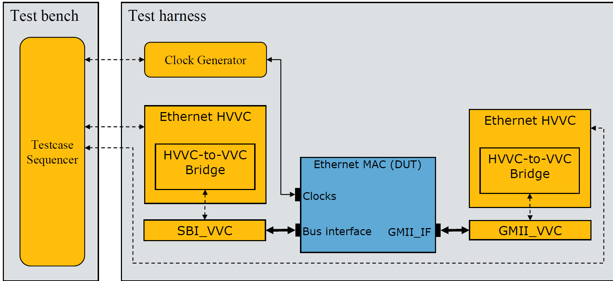

.. _vip_hvvc_to_vvc_bridge:

##################################################################################################################################
Bitvis VIP HVVC-to-VVC Bridge
##################################################################################################################################

.. important::

    This guide is meant for users that want to make their own HVVC-to-VVC bridge connect. 
    Users that only write test cases that are using the existing HVVCs and interfaces do NOT need to read this guide.

**********************************************************************************************************************************
Concept
**********************************************************************************************************************************
Many protocols and applications consist of several abstraction levels, e.g. physical layer, link layer, transaction layer, etc. 
When writing a test case for a higher level you most likely want to ignore the underlying levels and only deal with the scope of 
the relevant level. The test case will be less complex and easier to both write and read.

A hierarchical VVC (HVVC) is a VVC of a higher protocol level than the physical layer, i.e. it has no physical connections. The 
test case only communicates with the HVVC which communicate with the lower level. Data is propagated upwards and downwards between 
the HVVC and DUT through a standard VVC connected to the DUT.

The HVVC-to-VVC Bridge is the connection between a hierarchical VVC (HVVC) and the VVC at a lower protocol level, in this context 
referred to only as the VVC. Communications between the HVVC and VVC is handled by the HVVC-to-VVC Bridge. Data is transferred 
between the HVVC and HVVC-to-VVC Bridge on a common interface and converted in the HVVC-to-VVC Bridge to/from the specific 
interface of the VVC used. An example of this concept used on Ethernet is seen in Figure 1.

   Figure 1 - Example of HVVC-to-VVC Bridge implemented in an Ethernet HVVC

**********************************************************************************************************************************
Interface
**********************************************************************************************************************************
* Communication with the bridge is done through the ports in the HVVC-to-VVC bridge.
* All data transfer between the HVVC and bridge is in std_logic_vector array format.
* One port is used for each direction.
* Data from HVVC to HVVC-to-VVC Bridge is of type :ref:`t_hvvc_to_bridge`, and data from HVVC-to-VVC Bridge to HVVC is of type 
  :ref:`t_bridge_to_hvvc`.

**********************************************************************************************************************************
Generics
**********************************************************************************************************************************

+------------------------------+------------------------------+-----------------+-------------------------------------------------+
| Name                         | Type                         | Default         | Description                                     |
+==============================+==============================+=================+=================================================+
| GC_INSTANCE_IDX              | integer                      | N/A             | Instance index of the VVC                       |
+------------------------------+------------------------------+-----------------+-------------------------------------------------+
| GC_DUT_IF_FIELD_CONFIG       | t_dut_if_field_config_direct\| N/A             | Array of IF field configurations                |
|                              | ion_array                    |                 |                                                 |
+------------------------------+------------------------------+-----------------+-------------------------------------------------+
| GC_MAX_NUM_WORDS             | positive                     | N/A             | Max number of data words transferred in one     |
|                              |                              |                 | operation                                       |
+------------------------------+------------------------------+-----------------+-------------------------------------------------+
| GC_PHY_MAX_ACCESS_TIME       | time                         | N/A             | Maximum time that the PHY interface (lowest     |
|                              |                              |                 | protocol level) takes to execute an access, e.g.|
|                              |                              |                 | GMII writing 1 byte. It should account also for |
|                              |                              |                 | any margin it needs, e.g. receiver not ready.   |
+------------------------------+------------------------------+-----------------+-------------------------------------------------+
| GC_SCOPE                     | string                       | N/A             | Scope of the HVVC-to-VVC Bridge                 |
+------------------------------+------------------------------+-----------------+-------------------------------------------------+
| GC_WORD_ENDIANNESS           | t_word_endianness            | LOWER_WORD_LEFT | Word endianness when converting between         |
|                              |                              |                 | different slv array widths, e.g. LOWER_WORD_LEFT|
|                              |                              |                 | or LOWER_WORD_RIGHT                             |
+------------------------------+------------------------------+-----------------+-------------------------------------------------+

DUT interface field configuration array
==================================================================================================================================
If the interface of the VVC is address-based there needs to be a way to control which address to send the data to. This is done 
with the DUT IF field configurations.

An array of :ref:`t_dut_if_field_config` records is defined by the user and passed to the HVVC-to-VVC Bridge through the generic 
of the HVVC and HVVC-to-VVC Bridge. When a transmit or receive operation is sent to the HVVC-to-VVC Bridge the index of the DUT IF 
field config is specified in *dut_if_field_idx* in the hvvc_to_bridge port. The specified DUT IF field config states the address 
that shall be accessed. The address associated with each field can easily be changed by changing the DUT IF configuration.

**********************************************************************************************************************************
User implementation
**********************************************************************************************************************************
* The bridge is implemented as an entity and is instantiated inside the HVVC. 
* The different VVC interfaces are implemented as independent architectures due to better readability and extensibility. 
* When adding a new architecture remember to update *t_interface* type in uvvm_util/src/adaptations_pkg.vhd with the new VVC 
  interface name.

Example of implementation of GMII interface
==================================================================================================================================
A snippet of the implementation of GMII is shown as an example below.

.. code-block::

    -- Execute command
    case hvvc_to_bridge.operation is

      when TRANSMIT =>
        -- Convert from t_slv_array to t_byte_array
        v_data_bytes(0 to v_num_data_bytes-1) := convert_slv_array_to_byte_array(hvvc_to_bridge.data_words(0 to   hvvc_to_bridge.num_data_words-1), v_byte_endianness);
        gmii_write(GMII_VVCT, GC_INSTANCE_IDX, TX, v_data_bytes(0 to v_num_data_bytes-1), "Send data over GMII", GC_SCOPE,  hvvc_to_bridge.msg_id_panel);
        v_cmd_idx := get_last_received_cmd_idx(GMII_VVCT, GC_INSTANCE_IDX, TX, GC_SCOPE);
        await_completion(GMII_VVCT, GC_INSTANCE_IDX, TX, v_cmd_idx, v_num_transfers*GC_PHY_MAX_ACCESS_TIME, "Wait for write to finish.",  GC_SCOPE, hvvc_to_bridge.msg_id_panel);

      when RECEIVE =>
        gmii_read(GMII_VVCT, GC_INSTANCE_IDX, RX, v_num_data_bytes, "Read data over GMII", GC_SCOPE, hvvc_to_bridge.msg_id_panel);
        v_cmd_idx := get_last_received_cmd_idx(GMII_VVCT, GC_INSTANCE_IDX, RX, GC_SCOPE);
        await_completion(GMII_VVCT, GC_INSTANCE_IDX, RX, v_cmd_idx, v_num_transfers*GC_PHY_MAX_ACCESS_TIME, "Wait for read to finish.",   GC_SCOPE, hvvc_to_bridge.msg_id_panel);
        fetch_result(GMII_VVCT, GC_INSTANCE_IDX, RX, v_cmd_idx, v_gmii_received_data, "Fetching received data.", TB_ERROR, GC_SCOPE,  hvvc_to_bridge.msg_id_panel);
        -- Convert from t_byte_array back to t_slv_array
        bridge_to_hvvc.data_words(0 to hvvc_to_bridge.num_data_words-1) <=  convert_byte_array_to_slv_array(v_gmii_received_data.data_array(0 to v_num_data_bytes-1), c_data_words_width/8,   v_byte_endianness);

      when others =>
        alert(TB_ERROR, "Unsupported operation");

    end case;

Example of instantiation in HVVC
==================================================================================================================================
The example below shows an instantiation of the HVVC-to-VVC Bridge for GMII in an HVVC. The generics that might change in each 
instantiation of the HVVC, in this example the ones named GC_* on the right hand side of the generic map, are passed on through 
the HVVC from the test harness/testbench. Additional interfaces can be added by using the generate statement for each architecture.

.. code-block::

    gen_hvvc_bridge : if GC_PHY_INTERFACE = GMII generate
      i_hvvc_to_vvc_bridge : entity bitvis_vip_hvvc_to_vvc_bridge.hvvc_to_vvc_bridge(GMII)
        generic map(
          GC_INSTANCE_IDX        => GC_PHY_VVC_INSTANCE_IDX,
          GC_DUT_IF_FIELD_CONFIG => GC_DUT_IF_FIELD_CONFIG,
          GC_MAX_NUM_WORDS       => C_MAX_PACKET_LENGTH,
          GC_PHY_MAX_ACCESS_TIME => GC_PHY_MAX_ACCESS_TIME,
          GC_SCOPE               => C_SCOPE
        )
        port map(
          hvvc_to_bridge => hvvc_to_bridge,
          bridge_to_hvvc => bridge_to_hvvc
        );
    end generate gen_hvvc_bridge;

**********************************************************************************************************************************
Methods
**********************************************************************************************************************************
The following procedures are used by the HVVC when transmitting or requesting data from the HVVC-to-VVC Bridge

blocking_send_to_bridge()
==================================================================================================================================
Sends a data array to the HVVC-to-VVC Bridge and waits for a trigger signalling the bridge has finished. This procedure blocks the 
sequencer until it is done.

.. code-block::

    blocking_send_to_bridge(hvvc_to_bridge, bridge_to_hvvc, data_words, dut_if_field_idx, dut_if_field_pos, scope, msg_id_panel)

+----------+--------------------+--------+------------------------------+---------------------------------------------------------+
| Object   | Name               | Dir.   | Type                         | Description                                             |
+==========+====================+========+==============================+=========================================================+
| signal   | hvvc_to_bridge     | inout  | :ref:`t_hvvc_to_bridge`      | Data transmitted from the HVVC to the bridge            |
+----------+--------------------+--------+------------------------------+---------------------------------------------------------+
| signal   | bridge_to_hvvc     | in     | :ref:`t_bridge_to_hvvc`      | Data transmitted from the bridge to the HVVC            |
+----------+--------------------+--------+------------------------------+---------------------------------------------------------+
| constant | data_words         | in     | t_slv_array                  | Data to be sent to the bridge                           |
+----------+--------------------+--------+------------------------------+---------------------------------------------------------+
| constant | dut_if_field_idx   | in     | integer                      | Index of the interface field                            |
+----------+--------------------+--------+------------------------------+---------------------------------------------------------+
| constant | dut_if_field_pos   | in     | t_field_position             | Position of the interface field within the packet, e.g. |
|          |                    |        |                              | FIRST, MIDDLE, LAST or FIRST_AND_LAST.                  |
+----------+--------------------+--------+------------------------------+---------------------------------------------------------+
| constant | scope              | in     | string                       | Describes the scope from which the log/alert originates |
+----------+--------------------+--------+------------------------------+---------------------------------------------------------+
| constant | msg_id_panel       | in     | t_msg_id_panel               | Controls verbosity within a specified scope             |
+----------+--------------------+--------+------------------------------+---------------------------------------------------------+

.. code-block::

    -- Examples:
    blocking_send_to_bridge(hvvc_to_bridge, bridge_to_hvvc, v_data_array(0 to 9), C_FIELD_IDX_PAYLOAD, FIRST, C_SCOPE, v_msg_id_panel);

blocking_request_from_bridge()
==================================================================================================================================
Requests data from the HVVC-to-VVC Bridge and waits for a trigger signalling the bridge has finished. This procedure blocks the 
sequencer until it is done.

.. code-block::

    blocking_request_from_bridge(hvvc_to_bridge, bridge_to_hvvc, num_data_words, dut_if_field_idx, dut_if_field_pos, scope, msg_id_panel)

+----------+--------------------+--------+------------------------------+---------------------------------------------------------+
| Object   | Name               | Dir.   | Type                         | Description                                             |
+==========+====================+========+==============================+=========================================================+
| signal   | hvvc_to_bridge     | inout  | :ref:`t_hvvc_to_bridge`      | Data transmitted from the HVVC to the bridge            |
+----------+--------------------+--------+------------------------------+---------------------------------------------------------+
| signal   | bridge_to_hvvc     | in     | :ref:`t_bridge_to_hvvc`      | Data transmitted from the bridge to the HVVC            |
+----------+--------------------+--------+------------------------------+---------------------------------------------------------+
| constant | num_data_words     | in     | positive                     | Number of data words to be transferred                  |
+----------+--------------------+--------+------------------------------+---------------------------------------------------------+
| constant | dut_if_field_idx   | in     | integer                      | Index of the interface field                            |
+----------+--------------------+--------+------------------------------+---------------------------------------------------------+
| constant | dut_if_field_pos   | in     | t_field_position             | Position of the interface field within the packet, e.g. |
|          |                    |        |                              | FIRST, MIDDLE, LAST or FIRST_AND_LAST.                  |
+----------+--------------------+--------+------------------------------+---------------------------------------------------------+
| constant | scope              | in     | string                       | Describes the scope from which the log/alert originates |
+----------+--------------------+--------+------------------------------+---------------------------------------------------------+
| constant | msg_id_panel       | in     | t_msg_id_panel               | Controls verbosity within a specified scope             |
+----------+--------------------+--------+------------------------------+---------------------------------------------------------+

.. code-block::

    -- Examples:
    blocking_request_from_bridge(hvvc_to_bridge, bridge_to_hvvc, 10, C_FIELD_IDX_PAYLOAD, LAST, C_SCOPE, v_msg_id_panel);
    v_receive_words := bridge_to_hvvc.data_words(0 to 9); -- Save the received data

.. include:: rst_snippets/ip_disclaimer.rst
