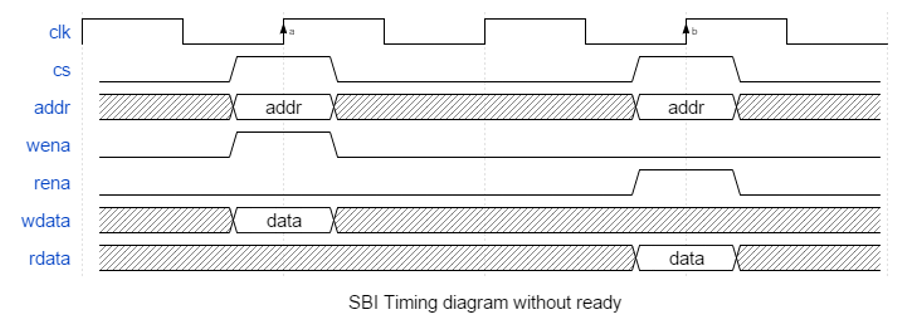

##################################################################################################################################
Bitvis VIP SBI
##################################################################################################################################

**Quick Access**

* `BFM`_

  * :ref:`sbi_write_bfm`
  * :ref:`sbi_read_bfm`
  * :ref:`sbi_check_bfm`
  * :ref:`sbi_poll_until_bfm`
  * :ref:`init_sbi_if_signals_bfm`

* `VVC`_

  * :ref:`sbi_write_vvc`
  * :ref:`sbi_read_vvc`
  * :ref:`sbi_check_vvc`
  * :ref:`sbi_poll_until_vvc`

.. include:: rst_snippets/subtitle_1_division.rst

**********************************************************************************************************************************
BFM
**********************************************************************************************************************************
BFM functionality is implemented in sbi_bfm_pkg.vhd

.. _t_sbi_if:

Signal Record
==================================================================================================================================
**t_sbi_if**

+-------------------------+------------------------------+
| Record element          | Type                         |
+=========================+==============================+
| cs                      | std_logic                    |
+-------------------------+------------------------------+
| addr                    | unsigned                     |
+-------------------------+------------------------------+
| wena                    | std_logic                    |
+-------------------------+------------------------------+
| rena                    | std_logic                    |
+-------------------------+------------------------------+
| wdata                   | std_logic_vector             |
+-------------------------+------------------------------+
| ready                   | std_logic                    |
+-------------------------+------------------------------+
| rdata                   | std_logic_vector             |
+-------------------------+------------------------------+

.. note::

    * BFM calls can also be made with listing of single signals rather than t_sbi_if.
    * If using non-ready version, set ready to '1' or set use_ready_signal to false.

.. _t_sbi_bfm_config:

Configuration Record
==================================================================================================================================
**t_sbi_bfm_config**

Default value for the record is C_SBI_BFM_CONFIG_DEFAULT.

+------------------------------+------------------------------+-----------------+-------------------------------------------------+
| Record element               | Type                         | Default         | Description                                     |
+==============================+==============================+=================+=================================================+
| max_wait_cycles              | integer                      | 10              | The maximum number of clock cycles to wait for  |
|                              |                              |                 | the DUT ready signal before reporting a timeout |
|                              |                              |                 | alert                                           |
+------------------------------+------------------------------+-----------------+-------------------------------------------------+
| max_wait_cycles_severity     | :ref:`t_alert_level`         | FAILURE         | The above timeout will have this severity       |
+------------------------------+------------------------------+-----------------+-------------------------------------------------+
| use_fixed_wait_cycles_read   | boolean                      | false           | When true, wait 'fixed_wait_cycles_read' after  |
|                              |                              |                 | asserting rena signal, before sampling rdata    |
+------------------------------+------------------------------+-----------------+-------------------------------------------------+
| fixed_wait_cycles_read       | natural                      | 0               | Number of clock cycles to wait after asserting  |
|                              |                              |                 | rena signal, before sampling rdata              |
+------------------------------+------------------------------+-----------------+-------------------------------------------------+
| clock_period                 | time                         | -1 ns           | Period of the clock signal                      |
+------------------------------+------------------------------+-----------------+-------------------------------------------------+
| clock_period_margin          | time                         | 0 ns            | Input clock period margin to specified          |
|                              |                              |                 | clock_period. Will check 'T/2' if input clock is|
|                              |                              |                 | low when BFM is called and 'T' if input clock is|
|                              |                              |                 | high.                                           |
+------------------------------+------------------------------+-----------------+-------------------------------------------------+
| clock_margin_severity        | :ref:`t_alert_level`         | TB_ERROR        | The above margin will have this severity        |
+------------------------------+------------------------------+-----------------+-------------------------------------------------+
| setup_time                   | time                         | -1 ns           | Generated signals setup time. Suggested value   |
|                              |                              |                 | is clock_period/4. An alert is reported if      |
|                              |                              |                 | setup_time exceeds clock_period/2.              |
+------------------------------+------------------------------+-----------------+-------------------------------------------------+
| hold_time                    | time                         | -1 ns           | Generated signals hold time. Suggested value    |
|                              |                              |                 | is clock_period/4. An alert is reported if      |
|                              |                              |                 | hold_time exceeds clock_period/2.               |
+------------------------------+------------------------------+-----------------+-------------------------------------------------+
| bfm_sync                     | :ref:`t_bfm_sync`            | SYNC_ON_CLOCK_O\| When set to SYNC_ON_CLOCK_ONLY the BFM will     |
|                              |                              | NLY             | enter on the first falling edge, estimate the   |
|                              |                              |                 | clock period,                                   |
|                              |                              |                 |                                                 |
|                              |                              |                 | synchronize the output signals and exit ¼       |
|                              |                              |                 | clock period after a succeeding rising edge.    |
|                              |                              |                 |                                                 |
|                              |                              |                 | When set to SYNC_WITH_SETUP_AND_HOLD the BFM    |
|                              |                              |                 | will use the configured setup_time, hold_time   |
|                              |                              |                 | and                                             |
|                              |                              |                 |                                                 |
|                              |                              |                 | clock_period to synchronize output signals      |
|                              |                              |                 | with clock edges.                               |
+------------------------------+------------------------------+-----------------+-------------------------------------------------+
| match_strictness             | :ref:`t_match_strictness`    | MATCH_EXACT     | Matching strictness for std_logic values in     |
|                              |                              |                 | check procedures.                               |
|                              |                              |                 |                                                 |
|                              |                              |                 | MATCH_EXACT requires both values to be the      |
|                              |                              |                 | same. Note that the expected value can contain  |
|                              |                              |                 | the don't care operator '-'.                    |
|                              |                              |                 |                                                 |
|                              |                              |                 | MATCH_STD allows comparisons between 'H' and    |
|                              |                              |                 | '1', 'L' and '0' and '-' in both values.        |
+------------------------------+------------------------------+-----------------+-------------------------------------------------+
| id_for_bfm                   | t_msg_id                     | ID_BFM          | Message ID used for logging general messages in |
|                              |                              |                 | the BFM                                         |
+------------------------------+------------------------------+-----------------+-------------------------------------------------+
| id_for_bfm_wait              | t_msg_id                     | ID_BFM_WAIT     | Message ID used for logging waits in the BFM    |
+------------------------------+------------------------------+-----------------+-------------------------------------------------+
| id_for_bfm_poll              | t_msg_id                     | ID_BFM_POLL     | Message ID used for logging polling in the BFM  |
+------------------------------+------------------------------+-----------------+-------------------------------------------------+
| use_ready_signal             | boolean                      | true            | Whether or not to use the interface 'ready'     |
|                              |                              |                 | signal                                          |
+------------------------------+------------------------------+-----------------+-------------------------------------------------+

Methods
==================================================================================================================================
* The record :ref:`t_sbi_if <t_sbi_if>` can be replaced with the signals listed in said record.
* All signals are active high.
* All parameters in brackets are optional.

.. _sbi_write_bfm:

sbi_write()
----------------------------------------------------------------------------------------------------------------------------------
Writes the given data to the given address on the DUT, using the SBI protocol:

.. code-block:: none

    1. - At 'config.clock_period'/4 before the first rising clock edge the bus lines are set:
        a. cs and wena are set to '1'
        b. rena is set to '0'
        c. addr is set to addr_value
        d. wdata is set to data_value
    2a. - With ready-signalling:
        a. on the first rising edge the DUT ready signal is evaluated:
            * If ready is '1', cs and wena are set to '0' again 'config.clock_period'/4 after the last rising edge and the write 
              procedure was successful.
            * If ready is '0', the procedure will wait one clock cycle and evaluate the ready signal again. This will repeat until 
              ready is set to '1', or invoke an error if the process has repeated 'config.max_wait_cycles times'. A log message with ID 
              'config.id_for_bfm_wait' is logged at the first wait.
    2b. - Without ready-signalling:
        a. cs and wena are set to '0' again 'config.clock_period'/4 after the first rising edge

The procedure reports an alert if ready signal is not set to '1' within 'config.max_wait_cycles' after cs and wena are set to '1' 
(alert_level: config.max_wait_cycles_severity).

.. code-block::

    sbi_write(addr_value, data_value, msg, clk, sbi_if, [scope, [msg_id_panel, [config]]])

+----------+--------------------+--------+------------------------------+---------------------------------------------------------+
| Object   | Name               | Dir.   | Type                         | Description                                             |
+==========+====================+========+==============================+=========================================================+
| constant | addr_value         | in     | unsigned                     | The address of a software accessible register           |
+----------+--------------------+--------+------------------------------+---------------------------------------------------------+
| constant | data_value         | in     | std_logic_vector             | The data value to be written to the addressed register  |
+----------+--------------------+--------+------------------------------+---------------------------------------------------------+
| constant | msg                | in     | string                       | A custom message to be appended in the log/alert        |
+----------+--------------------+--------+------------------------------+---------------------------------------------------------+
| signal   | clk                | in     | std_logic                    | The clock signal used to read and write data in/out of  |
|          |                    |        |                              | the SBI BFM                                             |
+----------+--------------------+--------+------------------------------+---------------------------------------------------------+
| signal   | sbi_if             | inout  | :ref:`t_sbi_if <t_sbi_if>`   | SBI signal interface record                             |
+----------+--------------------+--------+------------------------------+---------------------------------------------------------+
| constant | scope              | in     | string                       | Describes the scope from which the log/alert originates.|
|          |                    |        |                              | Default value is C_BFM_SCOPE ("SBI BFM").               |
+----------+--------------------+--------+------------------------------+---------------------------------------------------------+
| constant | msg_id_panel       | in     | t_msg_id_panel               | Controls verbosity within a specified scope. Default    |
|          |                    |        |                              | value is shared_msg_id_panel.                           |
+----------+--------------------+--------+------------------------------+---------------------------------------------------------+
| constant | config             | in     | :ref:`t_sbi_bfm_config       | Configuration of BFM behavior and restrictions. Default |
|          |                    |        | <t_sbi_bfm_config>`          | value is C_SBI_BFM_CONFIG_DEFAULT.                      |
+----------+--------------------+--------+------------------------------+---------------------------------------------------------+

.. code-block::

    -- Examples:
    sbi_write(x"1000", x"55", "Write data to Peripheral 1", clk, sbi_if);
    sbi_write(x"1000", x"55", "Write data to Peripheral 1", clk, sbi_if, C_SCOPE, shared_msg_id_panel, C_SBI_BFM_CONFIG_DEFAULT);

    -- Suggested usage (requires local overload, see 'Local BFM overloads' section):
    sbi_write(C_ADDR_UART_TX, x"40", "Set baud rate to 9600");

.. _sbi_read_bfm:

sbi_read()
----------------------------------------------------------------------------------------------------------------------------------
Reads data from the DUT at the given address, using the SBI protocol:

.. code-block:: none

    1. At 'config.clock_period'/4 before the first rising clock edge the bus lines are set:
        a. cs and rena are set to '1'
        b. wena is set to '0'
        c. addr is set to addr_value
    2a. With ready-signalling:
        a. On the first rising edge the DUT ready signal is evaluated:
            * If ready is '1', the data on the rdata line is returned to the reader in data_value.
            * If ready is '0', the procedure will wait one clock cycle and evaluate the ready signal again. This will repeat until 
              ready is set to '1', or invoke an error if the process has repeated 'config.max_wait_cycles' times. A log message with 
              ID 'config.id_for_bfm_wait' is logged at the first wait.
    2b. Without ready-signalling:
        a. On the first rising edge the data on the rdata line is returned to the reader in data_value.
    3. After 'config.clock_period'/4 cs and rena are set to '0' again

The procedure reports an alert if ready signal is not set to '1' within 'config.max_wait_cycles' after cs and wena are set to '1' 
(alert_level: config.max_wait_cycles_severity).

.. code-block::

    sbi_read(addr_value, data_value, msg, clk, sbi_if, [scope, [msg_id_panel, [config]]])

+----------+--------------------+--------+------------------------------+---------------------------------------------------------+
| Object   | Name               | Dir.   | Type                         | Description                                             |
+==========+====================+========+==============================+=========================================================+
| constant | addr_value         | in     | unsigned                     | The address of a software accessible register           |
+----------+--------------------+--------+------------------------------+---------------------------------------------------------+
| variable | data_value         | out    | std_logic_vector             | The data value read from the addressed register         |
+----------+--------------------+--------+------------------------------+---------------------------------------------------------+
| constant | msg                | in     | string                       | A custom message to be appended in the log/alert        |
+----------+--------------------+--------+------------------------------+---------------------------------------------------------+
| signal   | clk                | in     | std_logic                    | The clock signal used to read and write data in/out of  |
|          |                    |        |                              | the SBI BFM                                             |
+----------+--------------------+--------+------------------------------+---------------------------------------------------------+
| signal   | sbi_if             | inout  | :ref:`t_sbi_if <t_sbi_if>`   | SBI signal interface record                             |
+----------+--------------------+--------+------------------------------+---------------------------------------------------------+
| constant | scope              | in     | string                       | Describes the scope from which the log/alert originates.|
|          |                    |        |                              | Default value is C_BFM_SCOPE ("SBI BFM").               |
+----------+--------------------+--------+------------------------------+---------------------------------------------------------+
| constant | msg_id_panel       | in     | t_msg_id_panel               | Controls verbosity within a specified scope. Default    |
|          |                    |        |                              | value is shared_msg_id_panel.                           |
+----------+--------------------+--------+------------------------------+---------------------------------------------------------+
| constant | config             | in     | :ref:`t_sbi_bfm_config       | Configuration of BFM behavior and restrictions. Default |
|          |                    |        | <t_sbi_bfm_config>`          | value is C_SBI_BFM_CONFIG_DEFAULT.                      |
+----------+--------------------+--------+------------------------------+---------------------------------------------------------+

.. code-block::

    -- Examples:
    sbi_read(x"1000", v_data_out, "Read from Peripheral 1", clk, sbi_if);
    sbi_read(x"1000", v_data_out, "Read from Peripheral 1", clk, sbi_if, C_SCOPE, shared_msg_id_panel, C_SBI_BFM_CONFIG_DEFAULT);

    -- Suggested usage (requires local overload, see 'Local BFM overloads' section):
    sbi_read(C_ADDR_UART_BAUD, v_data_out, "Read UART baud rate");

.. _sbi_check_bfm:

sbi_check()
----------------------------------------------------------------------------------------------------------------------------------
Reads data from the DUT at the given address, using the SBI protocol described under :ref:`sbi_read_bfm`. After reading data from 
the SBI bus, the read data is compared with the expected data.

* If the check was successful, and the read data matches the expected data, a log message is written with ID 'config.id_for_bfm'.
* If the read data did not match the expected data, an alert with severity 'alert_level' will be reported.
* The procedure will also report alerts for the same conditions as the :ref:`sbi_read_bfm` procedure.

.. code-block::

    sbi_check(addr_value, data_exp, msg, clk, sbi_if, [alert_level, [scope, [msg_id_panel, [config]]]])

+----------+--------------------+--------+------------------------------+---------------------------------------------------------+
| Object   | Name               | Dir.   | Type                         | Description                                             |
+==========+====================+========+==============================+=========================================================+
| constant | addr_value         | in     | unsigned                     | The address of a software accessible register           |
+----------+--------------------+--------+------------------------------+---------------------------------------------------------+
| constant | data_exp           | in     | std_logic_vector             | The data value to expect when reading the addressed     |
|          |                    |        |                              | register. A mismatch results in an alert with severity  |
|          |                    |        |                              | 'alert_level'.                                          |
+----------+--------------------+--------+------------------------------+---------------------------------------------------------+
| constant | msg                | in     | string                       | A custom message to be appended in the log/alert        |
+----------+--------------------+--------+------------------------------+---------------------------------------------------------+
| signal   | clk                | in     | std_logic                    | The clock signal used to read and write data in/out of  |
|          |                    |        |                              | the SBI BFM                                             |
+----------+--------------------+--------+------------------------------+---------------------------------------------------------+
| signal   | sbi_if             | inout  | :ref:`t_sbi_if <t_sbi_if>`   | SBI signal interface record                             |
+----------+--------------------+--------+------------------------------+---------------------------------------------------------+
| constant | alert_level        | in     | :ref:`t_alert_level`         | Sets the severity for the alert. Default value is ERROR.|
+----------+--------------------+--------+------------------------------+---------------------------------------------------------+
| constant | scope              | in     | string                       | Describes the scope from which the log/alert originates.|
|          |                    |        |                              | Default value is C_BFM_SCOPE ("SBI BFM").               |
+----------+--------------------+--------+------------------------------+---------------------------------------------------------+
| constant | msg_id_panel       | in     | t_msg_id_panel               | Controls verbosity within a specified scope. Default    |
|          |                    |        |                              | value is shared_msg_id_panel.                           |
+----------+--------------------+--------+------------------------------+---------------------------------------------------------+
| constant | config             | in     | :ref:`t_sbi_bfm_config       | Configuration of BFM behavior and restrictions. Default |
|          |                    |        | <t_sbi_bfm_config>`          | value is C_SBI_BFM_CONFIG_DEFAULT.                      |
+----------+--------------------+--------+------------------------------+---------------------------------------------------------+

.. code-block::

    -- Examples:
    sbi_check(x"1155", x"3B", "Check data from Peripheral 1", clk, sbi_if);
    sbi_check(x"1155", x"3B", "Check data from Peripheral 1", clk, sbi_if, ERROR, C_SCOPE, shared_msg_id_panel, C_SBI_BFM_CONFIG_DEFAULT);

    -- Suggested usage (requires local overload, see 'Local BFM overloads' section):
    sbi_check(C_ADDR_UART_RX, x"3B", "Check data from UART RX buffer");

.. _sbi_poll_until_bfm:

sbi_poll_until()
----------------------------------------------------------------------------------------------------------------------------------
Reads data from the DUT at the given address, using the SBI protocol described under :ref:`sbi_read_bfm`. After reading data from 
the DUT, the read data is compared with the expected data. If the read data does not match the expected data, the process is 
repeated until one or more of the following occurs:

1. The read data matches the expected data
2. The number of read retries is equal to 'max_polls'
3. The time between start of sbi_poll_until procedure and now is greater than 'timeout'
4. The terminate_loop signal is set to '1'

If the procedure exits because of 2. or 3. an alert with severity 'alert_level' is issued. If either 'max_polls' or 'timeout' is 
set to 0 (ns), this constraint will be ignored and interpreted as no limit.

* If the check was successful, and the read data matches the expected data, a log message is written with ID 'config.id_for_bfm'.
* If the read data did not match the expected data, an alert with severity 'alert_level' will be reported.
* If the procedure is terminated using 'terminate_loop' a log message with ID ID_TERMINATE_CMD will be issued.
* The procedure will also report alerts for the same conditions as the :ref:`sbi_read_bfm` procedure.

.. code-block::

    sbi_poll_until(addr_value, data_exp, max_polls, timeout, msg, clk, sbi_if, terminate_loop, [alert_level, [scope, [msg_id_panel, [config]]]])

+----------+--------------------+--------+------------------------------+---------------------------------------------------------+
| Object   | Name               | Dir.   | Type                         | Description                                             |
+==========+====================+========+==============================+=========================================================+
| constant | addr_value         | in     | unsigned                     | The address of a software accessible register           |
+----------+--------------------+--------+------------------------------+---------------------------------------------------------+
| constant | data_exp           | in     | std_logic_vector             | The data value to expect when reading the addressed     |
|          |                    |        |                              | register. A mismatch results in an alert with severity  |
|          |                    |        |                              | 'alert_level'.                                          |
+----------+--------------------+--------+------------------------------+---------------------------------------------------------+
| constant | max_polls          | in     | integer                      | The maximum number of polls (reads) before the expected |
|          |                    |        |                              | data must be found. Exceeding this limit results in an  |
|          |                    |        |                              | alert with severity 'alert_level'. Note that 0 means no |
|          |                    |        |                              | limit.                                                  |
+----------+--------------------+--------+------------------------------+---------------------------------------------------------+
| constant | timeout            | in     | time                         | The maximum time to pass before the expected data must  |
|          |                    |        |                              | be found. Exceeding this limit results in an alert with |
|          |                    |        |                              | severity 'alert_level'. Note that 0 ns means no timeout.|
+----------+--------------------+--------+------------------------------+---------------------------------------------------------+
| constant | msg                | in     | string                       | A custom message to be appended in the log/alert        |
+----------+--------------------+--------+------------------------------+---------------------------------------------------------+
| signal   | clk                | in     | std_logic                    | The clock signal used to read and write data in/out of  |
|          |                    |        |                              | the SBI BFM                                             |
+----------+--------------------+--------+------------------------------+---------------------------------------------------------+
| signal   | sbi_if             | inout  | :ref:`t_sbi_if <t_sbi_if>`   | SBI signal interface record                             |
+----------+--------------------+--------+------------------------------+---------------------------------------------------------+
| signal   | terminate_loop     | in     | std_logic                    | External control of loop termination to e.g. stop       |
|          |                    |        |                              | polling prematurely                                     |
+----------+--------------------+--------+------------------------------+---------------------------------------------------------+
| constant | alert_level        | in     | :ref:`t_alert_level`         | Sets the severity for the alert. Default value is ERROR.|
+----------+--------------------+--------+------------------------------+---------------------------------------------------------+
| constant | scope              | in     | string                       | Describes the scope from which the log/alert originates.|
|          |                    |        |                              | Default value is C_BFM_SCOPE ("SBI BFM").               |
+----------+--------------------+--------+------------------------------+---------------------------------------------------------+
| constant | msg_id_panel       | in     | t_msg_id_panel               | Controls verbosity within a specified scope. Default    |
|          |                    |        |                              | value is shared_msg_id_panel.                           |
+----------+--------------------+--------+------------------------------+---------------------------------------------------------+
| constant | config             | in     | :ref:`t_sbi_bfm_config       | Configuration of BFM behavior and restrictions. Default |
|          |                    |        | <t_sbi_bfm_config>`          | value is C_SBI_BFM_CONFIG_DEFAULT.                      |
+----------+--------------------+--------+------------------------------+---------------------------------------------------------+

.. code-block::

    -- Examples:
    sbi_poll_until(x"1155", x"0D", 10, 100 ns, "Poll for data from Peripheral 1", clk, sbi_if, terminate_loop);
    sbi_poll_until(x"1155", x"0D", 10, 100 ns, "Poll for data from Peripheral 1", clk, sbi_if, terminate_loop, ERROR, C_SCOPE, shared_msg_id_panel, C_SBI_BFM_CONFIG_DEFAULT);

    -- Suggested usage (requires local overload, see 'Local BFM overloads' section):
    sbi_poll_until(C_ADDR_UART_RX, x"0D", "Poll UART RX buffer until CR is found");
    sbi_poll_until(C_ADDR_UART_RX, x"0D", C_MAX_POLLS, C_TIMEOUT, "Poll UART RX buffer until CR is found");

.. _init_sbi_if_signals_bfm:

init_sbi_if_signals()
----------------------------------------------------------------------------------------------------------------------------------
Initializes the SBI interface. All the BFM outputs are set to '0', and BFM inputs are set to 'Z'.

.. code-block::

    t_sbi_if := init_sbi_if_signals(addr_width, data_width)

+----------+--------------------+--------+------------------------------+---------------------------------------------------------+
| Object   | Name               | Dir.   | Type                         | Description                                             |
+==========+====================+========+==============================+=========================================================+
| constant | addr_width         | in     | natural                      | Width of the address signal                             |
+----------+--------------------+--------+------------------------------+---------------------------------------------------------+
| constant | data_width         | in     | natural                      | Width of the data signals                               |
+----------+--------------------+--------+------------------------------+---------------------------------------------------------+

.. code-block::

    -- Examples:
    sbi_if <= init_sbi_if_signals(sbi_if.addr'length, sbi_if.wdata'length);

Local BFM overloads
==================================================================================================================================
A good approach for better readability and maintainability is to make simple, local overloads for the BFM procedures in the TB 
process. This allows calling the BFM procedures with the key parameters only, e.g. ::

    sbi_write(C_ADDR_UART_BAUDRATE, C_BAUDRATE_9600, "Set Baud-rate to 9600");

rather than ::

    sbi_write(C_ADDR_UART_BAUDRATE, C_BAUDRATE_9600, "Set Baud-rate to 9600", clk, sbi_if, C_SCOPE, shared_msg_id_panel, C_SBI_CONFIG_DEFAULT);

By defining the local overload as e.g. ::

    procedure sbi_write(
      constant addr_value : in unsigned;
      constant data_value : in std_logic_vector;
      constant msg        : in string) is
    begin
      sbi_write(addr_value,          -- Keep as is
                data_value,          -- Keep as is
                msg,                 -- Keep as is
                clk,                 -- Signal must be visible in local process scope
                sbi_if,              -- Signal must be visible in local process scope
                C_SCOPE,             -- Use the default
                shared_msg_id_panel, -- Use global, shared msg_id_panel
                C_SBI_CONFIG_LOCAL); -- Use locally defined configuration or C_SBI_CONFIG_DEFAULT
    end procedure;

Using a local overload like this also allows the following – if wanted:

* Have address value as natural – and convert in the overload
* Set up defaults for constants. May be different for two overloads of the same BFM
* Apply dedicated message ID panel to allow dedicated verbosity control

Compilation
==================================================================================================================================
.. include:: rst_snippets/bfm_compilation.rst

Simulator compatibility and setup
----------------------------------------------------------------------------------------------------------------------------------
.. include:: rst_snippets/simulator_compatibility.rst

Additional Documentation
==================================================================================================================================
The SBI BFM is used in the IRQC example provided with the UVVM Utility Library. Thus, you can find info under:

    * Making a simple, structured and efficient VHDL testbench – Step-by-step [PPT]  *(located in /uvvm_util/doc/Simple_TB_step_by_step.pps)*

There is also a webinar available on 'Making a simple, structured and efficient VHDL testbench – Step-by-step' (via Aldec [#f1]_)

SBI protocol
----------------------------------------------------------------------------------------------------------------------------------
SBI is our name for the simplest bus interface possible, one that has been used for decades in the electronics industry. Some 
think of it as a simple SRAM interface, but that is not a standard, and is probably understood and used in many different ways. 
Thus, we have defined a name and an exact behavior, with some flexibility.

SBI is a single cycle bus with an optional ready-signalling. The protocol for SBI with and without ready-signalling is given below. 
(Note that ready is always high in the without case). Data is sampled on rising edge **a** and **b**.

.. image:: images/vip_sbi/sbi_protocol_2.png
   :alt: SBI protocol with ready
   :width: 750pt
   :align: center

As can be seen from the figure all required signals including data input must be ready on the rising edge of the clock. This also 
applies for a read access, but the actual data output is provided combinatorial as soon as the combinational logic allows.
Note that an active 'cs', a valid 'addr' and an active 'wena' or 'rena' is needed on the same active clock edge to be registered 
as a valid read or write. (Being active on two consecutive rising clocks will result in two consecutive accesses - with or without 
side-effects depending on the module's internal functional logic.) 'rdata' will just ripple out for the right combination of 'cs', 
'addr' and 'rena'.

With this simple version, the designer has the option to provide input and/or output registers externally to allow a higher 
frequency (with added latency). SBI has optional ready-signalling (you may choose to have ready always high). When 'ready' is used 
it applies to both read and write accesses. For both read and write accesses all input signals must be held until 'ready' is active. 
For a read access, the output data may not be used (sampled) until 'ready' is active, but must do so on the first rising edge of 
the clock after 'ready' active.

.. important::

    * This is a simplified Bus Functional Model (BFM) for SBI.
    * The given BFM complies with the basic SBI protocol and thus allows a normal access towards a SBI interface.
    * This BFM is not a SBI protocol checker.
    * For a more advanced BFM please contact UVVM support at info@uvvm.org

.. include:: rst_snippets/subtitle_1_division.rst

**********************************************************************************************************************************
VVC
**********************************************************************************************************************************
* VVC functionality is implemented in sbi_vvc.vhd
* For general information see :ref:`VVC Framework - Essential Mechanisms <vvc_framework_essential_mechanisms>`.

Entity
==================================================================================================================================

Generics
----------------------------------------------------------------------------------------------------------------------------------

+------------------------------+------------------------------+-----------------+-------------------------------------------------+
| Name                         | Type                         | Default         | Description                                     |
+==============================+==============================+=================+=================================================+
| GC_ADDR_WIDTH                | integer                      | 8               | Width of the SBI address bus                    |
+------------------------------+------------------------------+-----------------+-------------------------------------------------+
| GC_DATA_WIDTH                | integer                      | 32              | Width of the SBI data bus                       |
+------------------------------+------------------------------+-----------------+-------------------------------------------------+
| GC_INSTANCE_IDX              | natural                      | 1               | Instance number to assign the VVC               |
+------------------------------+------------------------------+-----------------+-------------------------------------------------+
| GC_SBI_CONFIG                | :ref:`t_sbi_bfm_config       | C_SBI_BFM_CONFI\| Configuration for the SBI BFM                   |
|                              | <t_sbi_bfm_config>`          | G_DEFAULT       |                                                 |
+------------------------------+------------------------------+-----------------+-------------------------------------------------+
| GC_CMD_QUEUE_COUNT_MAX       | natural                      | C_CMD_QUEUE_COU\| Absolute maximum number of commands in the VVC  |
|                              |                              | NT_MAX          | command queue                                   |
+------------------------------+------------------------------+-----------------+-------------------------------------------------+
| GC_CMD_QUEUE_COUNT_THRESHOLD | natural                      | C_CMD_QUEUE_COU\| An alert will be generated when reaching this   |
|                              |                              | NT_THRESHOLD    | threshold to indicate that the command queue is |
|                              |                              |                 | almost full. The queue will still accept new co\|
|                              |                              |                 | mmands until it reaches GC_CMD_QUEUE_COUNT_MAX. |
+------------------------------+------------------------------+-----------------+-------------------------------------------------+
| GC_CMD_QUEUE_COUNT_THRESHOLD\| :ref:`t_alert_level`         | C_CMD_QUEUE_COU\| Alert severity which will be used when command  |
| _SEVERITY                    |                              | NT_THRESHOLD_SE\| queue reaches GC_CMD_QUEUE_COUNT_THRESHOLD      |
|                              |                              | VERITY          |                                                 |
+------------------------------+------------------------------+-----------------+-------------------------------------------------+
| GC_RESULT_QUEUE_COUNT_MAX    | natural                      | C_RESULT_QUEUE\ | Maximum number of unfetched results before      |
|                              |                              | _COUNT_MAX      | result_queue is full                            |
+------------------------------+------------------------------+-----------------+-------------------------------------------------+
| GC_RESULT_QUEUE_COUNT_THRESH\| natural                      | C_RESULT_QUEUE\ | An alert will be issued if result queue exceeds |
| OLD                          |                              | _COUNT_THRESHOLD| this count. Used for early warning if result    |
|                              |                              |                 | queue is almost full. Will be ignored if set to |
|                              |                              |                 | 0.                                              |
+------------------------------+------------------------------+-----------------+-------------------------------------------------+
| GC_RESULT_QUEUE_COUNT_THRESH\| :ref:`t_alert_level`         | C_RESULT_QUEUE \| Severity of alert to be initiated if exceeding  |
| OLD_SEVERITY                 |                              | _COUNT_THRESHOL\| GC_RESULT_QUEUE_COUNT_THRESHOLD                 |
|                              |                              | D_SEVERITY      |                                                 |
+------------------------------+------------------------------+-----------------+-------------------------------------------------+

Signals
----------------------------------------------------------------------------------------------------------------------------------

+----------+--------------------+--------+------------------------------+---------------------------------------------------------+
| Object   | Name               | Dir.   | Type                         | Description                                             |
+==========+====================+========+==============================+=========================================================+
| signal   | clk                | in     | std_logic                    | VVC Clock signal                                        |
+----------+--------------------+--------+------------------------------+---------------------------------------------------------+
| signal   | sbi_vvc_master_if  | inout  | :ref:`t_sbi_if <t_sbi_if>`   | SBI signal interface record                             |
+----------+--------------------+--------+------------------------------+---------------------------------------------------------+

In this VVC, the interface has been encapsulated in a signal record of type t_sbi_if in order to improve readability of the code. 
Since the SBI interface buses can be of arbitrary size, the interface vectors have been left unconstrained. These unconstrained 
vectors need to be constrained when the interface signals are instantiated. For this interface, it could look like: ::

    signal sbi_if : t_sbi_if(addr(C_ADDR_WIDTH - 1 downto 0),
                             wdata(C_DATA_WIDTH - 1 downto 0),
                             rdata(C_DATA_WIDTH - 1 downto 0));

Configuration Record
==================================================================================================================================
**vvc_config** accessible via **shared_sbi_vvc_config**

+------------------------------+------------------------------+-----------------+-------------------------------------------------+
| Record element               | Type                         | Default         | Description                                     |
+==============================+==============================+=================+=================================================+
| inter_bfm_delay              | :ref:`t_inter_bfm_delay`     | C_SBI_INTER_BFM\| Delay between any requested BFM accesses        |
|                              |                              | _DELAY_DEFAULT  | towards the DUT.                                |
|                              |                              |                 |                                                 |
|                              |                              |                 | TIME_START2START: Time from a BFM start to the  |
|                              |                              |                 | next BFM start (a TB_WARNING will be issued if  |
|                              |                              |                 | access takes longer than TIME_START2START).     |
|                              |                              |                 |                                                 |
|                              |                              |                 | TIME_FINISH2START: Time from a BFM end to the   |
|                              |                              |                 | next BFM start.                                 |
|                              |                              |                 |                                                 |
|                              |                              |                 | Any insert_delay() command will add to the      |
|                              |                              |                 | above minimum delays, giving for instance the   |
|                              |                              |                 | ability to skew the BFM starting time.          |
+------------------------------+------------------------------+-----------------+-------------------------------------------------+
| cmd_queue_count_max          | natural                      | C_CMD_QUEUE_COU\| Maximum pending number in command queue before  |
|                              |                              | NT_MAX          | queue is full. Adding additional commands will  |
|                              |                              |                 | result in an ERROR.                             |
+------------------------------+------------------------------+-----------------+-------------------------------------------------+
| cmd_queue_count_threshold    | natural                      | C_CMD_QUEUE_COU\| An alert will be issued if command queue exceeds|
|                              |                              | NT_THRESHOLD    | this count. Used for early warning if command   |
|                              |                              |                 | queue is almost full. Will be ignored if set to |
|                              |                              |                 | 0.                                              |
+------------------------------+------------------------------+-----------------+-------------------------------------------------+
| cmd_queue_count_threshold_se\| :ref:`t_alert_level`         | C_CMD_QUEUE_COU\| Severity of alert to be initiated if exceeding  |
| verity                       |                              | NT_THRESHOLD_SE\| cmd_queue_count_threshold                       |
|                              |                              | ERITY           |                                                 |
+------------------------------+------------------------------+-----------------+-------------------------------------------------+
| result_queue_count_max       | natural                      | C_RESULT_QUEUE\ | Maximum number of unfetched results before      |
|                              |                              | _COUNT_MAX      | result_queue is full                            |
+------------------------------+------------------------------+-----------------+-------------------------------------------------+
| result_queue_count_threshold | natural                      | C_RESULT_QUEUE\ | An alert will be issued if result queue exceeds |
|                              |                              | _COUNT_THRESHOLD| this count. Used for early warning if result    |
|                              |                              |                 | queue is almost full. Will be ignored if set to |
|                              |                              |                 | 0.                                              |
+------------------------------+------------------------------+-----------------+-------------------------------------------------+
| result_queue_count_threshold\| :ref:`t_alert_level`         | C_RESULT_QUEUE\ | Severity of alert to be initiated if exceeding  |
| _severity                    |                              | _COUNT_THRESHOL\| result_queue_count_threshold                    |
|                              |                              | D_SEVERITY      |                                                 |
+------------------------------+------------------------------+-----------------+-------------------------------------------------+
| bfm_config                   | :ref:`t_sbi_bfm_config       | C_SBI_BFM_CONFI\| Configuration for the SBI BFM                   |
|                              | <t_sbi_bfm_config>`          | G_DEFAULT       |                                                 |
+------------------------------+------------------------------+-----------------+-------------------------------------------------+
| msg_id_panel                 | t_msg_id_panel               | C_VVC_MSG_ID_PA\| VVC dedicated message ID panel. See             |
|                              |                              | NEL_DEFAULT     | :ref:`vvc_framework_verbosity_ctrl` for how to  |
|                              |                              |                 | use verbosity control.                          |
+------------------------------+------------------------------+-----------------+-------------------------------------------------+
| unwanted_activity_severity   | :ref:`t_alert_level`         | C_UNWANTED_ACTI\| Severity of alert to be issued if unwanted      |
|                              |                              | VITY_SEVERITY   | activity on the DUT outputs is detected. It is  |
|                              |                              |                 | enabled with ERROR severity by default.         |
+------------------------------+------------------------------+-----------------+-------------------------------------------------+

.. note::

    cmd/result queue parameters in the configuration record are unused and will be removed in v3.0, use instead the entity generic constants.

The configuration record can be accessed from the Central Testbench Sequencer through the shared variable array, e.g. ::

    shared_sbi_vvc_config(C_VVC_IDX).inter_bfm_delay.delay_in_time := 50 ns;
    shared_sbi_vvc_config(C_VVC_IDX).bfm_config.id_for_bfm := ID_BFM;

Status Record
==================================================================================================================================
**vvc_status** accessible via **shared_sbi_vvc_status**

.. include:: rst_snippets/vip_vvc_status.rst

Methods
==================================================================================================================================
* All VVC procedures are defined in vvc_methods_pkg.vhd (dedicated to this VVC).
* See :ref:`vvc_framework_methods` for procedures which are common to all VVCs.
* It is also possible to send a multicast to all instances of a VVC with ALL_INSTANCES as parameter for vvc_instance_idx.
* All parameters in brackets are optional.

.. _sbi_write_vvc:

sbi_write()
----------------------------------------------------------------------------------------------------------------------------------
| Adds a write command to the SBI VVC executor queue, which will run as soon as all preceding commands have completed. It has two 
  variants using either just data for a basic single transaction, or num_words + randomization for a more advanced version.
| When the basic write command is scheduled to run, the executor calls the BFM :ref:`sbi_write_bfm` procedure.
| When the more advanced randomization command is applied, the basic BFM sbi_write() transaction is executed num_words 
  times with new random data each time – according to the given randomization profile. Current defined randomization profiles are: 
  RANDOM: Standard uniform random. This is provided as an example.

.. code-block::

    sbi_write(VVCT, vvc_instance_idx, addr, data, msg, [scope])
    sbi_write(VVCT, vvc_instance_idx, addr, num_words, randomisation, msg, [scope])

+----------+--------------------+--------+------------------------------+---------------------------------------------------------+
| Object   | Name               | Dir.   | Type                         | Description                                             |
+==========+====================+========+==============================+=========================================================+
| signal   | VVCT               | inout  | t_vvc_target_record          | VVC target type compiled into each VVC in order to      |
|          |                    |        |                              | differentiate between VVCs                              |
+----------+--------------------+--------+------------------------------+---------------------------------------------------------+
| constant | vvc_instance_idx   | in     | integer                      | Instance number of the VVC                              |
+----------+--------------------+--------+------------------------------+---------------------------------------------------------+
| constant | addr               | in     | unsigned                     | The address of a SW accessible register. Could be offset|
|          |                    |        |                              | or full address depending on the DUT.                   |
+----------+--------------------+--------+------------------------------+---------------------------------------------------------+
| constant | data               | in     | std_logic_vector             | The data value to be written to the addressed register  |
+----------+--------------------+--------+------------------------------+---------------------------------------------------------+
| constant | num_words          | in     | natural                      | Number of times the procedure is called to send new     |
|          |                    |        |                              | random data words                                       |
+----------+--------------------+--------+------------------------------+---------------------------------------------------------+
| constant | randomisation      | in     | t_randomisation              | Randomization profile                                   |
+----------+--------------------+--------+------------------------------+---------------------------------------------------------+
| constant | msg                | in     | string                       | A custom message to be appended in the log/alert        |
+----------+--------------------+--------+------------------------------+---------------------------------------------------------+
| constant | scope              | in     | string                       | Describes the scope from which the log/alert originates.|
|          |                    |        |                              | Default value is C_VVC_CMD_SCOPE_DEFAULT.               |
+----------+--------------------+--------+------------------------------+---------------------------------------------------------+

.. code-block::

    -- Examples:
    sbi_write(SBI_VVCT, 0, x"1000", x"40", "Set UART baud rate to 9600", C_SCOPE);
    sbi_write(SBI_VVCT, 0, x"1001", 7, RANDOM, "Write 7 random bytes to UART TX");

    -- It is recommended to use constants to improve the readability of the code, e.g.:
    sbi_write(SBI_VVCT, 0, C_ADDR_UART_BAUDRATE, C_BAUDRATE_9600, "Set UART baud rate to 9600");

.. _sbi_read_vvc:

sbi_read()
----------------------------------------------------------------------------------------------------------------------------------
Adds a read command to the SBI VVC executor queue, which will run as soon as all preceding commands have completed. When the 
command is scheduled to run, the executor calls the BFM :ref:`sbi_read_bfm` procedure.

The value read from DUT will not be returned in this procedure call since it is non-blocking for the sequencer/caller, but the 
read data will be stored in the VVC for a potential future fetch (see example with fetch_result below).
If the data_routing is set to TO_SB, the read data will be sent to the SBI VVC dedicated scoreboard where it will be 
checked against the expected value (provided by the testbench).

.. code-block::

    sbi_read(VVCT, vvc_instance_idx, addr, [data_routing,] msg, [scope])

+----------+--------------------+--------+------------------------------+---------------------------------------------------------+
| Object   | Name               | Dir.   | Type                         | Description                                             |
+==========+====================+========+==============================+=========================================================+
| signal   | VVCT               | inout  | t_vvc_target_record          | VVC target type compiled into each VVC in order to      |
|          |                    |        |                              | differentiate between VVCs                              |
+----------+--------------------+--------+------------------------------+---------------------------------------------------------+
| constant | vvc_instance_idx   | in     | integer                      | Instance number of the VVC                              |
+----------+--------------------+--------+------------------------------+---------------------------------------------------------+
| constant | addr               | in     | unsigned                     | The address of a SW accessible register. Could be offset|
|          |                    |        |                              | or full address depending on the DUT.                   |
+----------+--------------------+--------+------------------------------+---------------------------------------------------------+
| constant | data_routing       | in     | :ref:`t_data_routing`        | Selects the destination of the read data                |
+----------+--------------------+--------+------------------------------+---------------------------------------------------------+
| constant | msg                | in     | string                       | A custom message to be appended in the log/alert        |
+----------+--------------------+--------+------------------------------+---------------------------------------------------------+
| constant | scope              | in     | string                       | Describes the scope from which the log/alert originates.|
|          |                    |        |                              | Default value is C_VVC_CMD_SCOPE_DEFAULT.               |
+----------+--------------------+--------+------------------------------+---------------------------------------------------------+

.. code-block::

    -- Examples:
    sbi_read(SBI_VVCT, 0, x"1000", "Read UART baud rate", C_SCOPE);
    sbi_read(SBI_VVCT, 0, x"1002", TO_SB, "Read UART RX and send to Scoreboard", C_SCOPE);

    -- It is recommended to use constants to improve the readability of the code, e.g.:
    sbi_read(SBI_VVCT, 0, C_ADDR_UART_BAUDRATE, "Read UART baud rate");

    -- Example with fetch_result() call: Result is placed in v_result
    variable v_cmd_idx : natural;                       -- Command index for the last read
    variable v_result  : work.vvc_cmd_pkg.t_vvc_result; -- Result from read.
    ...
    sbi_read(SBI_VVCT, 0, C_ADDR_UART_BAUDRATE, "Read from Peripheral 1");
    v_cmd_idx := get_last_received_cmd_idx(SBI_VVCT, 0);
    await_completion(SBI_VVCT, 0, v_cmd_idx, 1 us, "Wait for read to finish");
    fetch_result(SBI_VVCT, 0, v_cmd_idx, v_result, "Fetching result from read operation");

.. hint::

    :ref:`t_vvc_result` is defined in the corresponding vvc_cmd_pkg.vhd for the VIP.

.. _sbi_check_vvc:

sbi_check()
----------------------------------------------------------------------------------------------------------------------------------
Adds a check command to the SBI VVC executor queue, which will run as soon as all preceding commands have completed. When the 
command is scheduled to run, the executor calls the BFM :ref:`sbi_check_bfm` procedure. The sbi_check() procedure will perform a 
read operation, then check if the read data is equal to the expected data in the data parameter. If the read data is not equal to 
the expected data parameter, an alert with severity 'alert_level' will be issued. The read data will not be stored in this procedure.

.. code-block::

    sbi_check(VVCT, vvc_instance_idx, addr, data, msg, [alert_level, [scope]])

+----------+--------------------+--------+------------------------------+---------------------------------------------------------+
| Object   | Name               | Dir.   | Type                         | Description                                             |
+==========+====================+========+==============================+=========================================================+
| signal   | VVCT               | inout  | t_vvc_target_record          | VVC target type compiled into each VVC in order to      |
|          |                    |        |                              | differentiate between VVCs                              |
+----------+--------------------+--------+------------------------------+---------------------------------------------------------+
| constant | vvc_instance_idx   | in     | integer                      | Instance number of the VVC                              |
+----------+--------------------+--------+------------------------------+---------------------------------------------------------+
| constant | addr               | in     | unsigned                     | The address of a SW accessible register. Could be offset|
|          |                    |        |                              | or full address depending on the DUT.                   |
+----------+--------------------+--------+------------------------------+---------------------------------------------------------+
| constant | data               | in     | std_logic_vector             | The expected data value to be read from the addressed   |
|          |                    |        |                              | register                                                |
+----------+--------------------+--------+------------------------------+---------------------------------------------------------+
| constant | msg                | in     | string                       | A custom message to be appended in the log/alert        |
+----------+--------------------+--------+------------------------------+---------------------------------------------------------+
| constant | alert_level        | in     | :ref:`t_alert_level`         | Sets the severity for the alert. Default value is ERROR.|
+----------+--------------------+--------+------------------------------+---------------------------------------------------------+
| constant | scope              | in     | string                       | Describes the scope from which the log/alert originates.|
|          |                    |        |                              | Default value is C_VVC_CMD_SCOPE_DEFAULT.               |
+----------+--------------------+--------+------------------------------+---------------------------------------------------------+

.. code-block::

    -- Examples:
    sbi_check(SBI_VVCT, 0, x"1155", x"3B", "Check data from UART RX");
    sbi_check(SBI_VVCT, 0, x"1155", x"3B", "Check data from UART RX", TB_ERROR, C_SCOPE):

    -- It is recommended to use constants to improve the readability of the code, e.g.:
    sbi_check(SBI_VVCT, 0, C_ADDR_UART_RX, C_UART_START_BYTE, "Check data from UART RX");

.. _sbi_poll_until_vvc:

sbi_poll_until()
----------------------------------------------------------------------------------------------------------------------------------
Adds a poll_until command to the SBI VVC executor queue, which will run as soon as all preceding commands have completed. When the 
command is scheduled to run, the executor calls the BFM :ref:`sbi_poll_until_bfm` procedure. The sbi_poll_until() procedure will 
perform a read operation, then check if the read data is equal to the data in the data parameter. If the read data is not equal to 
the expected data parameter, the process will be repeated until the read data is equal to the expected data, or the procedure is 
terminated by either a terminate command, a timeout or the poll limit set in max_polls. The read data will not be stored by this 
procedure.

.. code-block::

    sbi_poll_until(VVCT, vvc_instance_idx, addr, data, msg, [max_polls, [timeout, [alert_level, [scope]]]])

+----------+--------------------+--------+------------------------------+---------------------------------------------------------+
| Object   | Name               | Dir.   | Type                         | Description                                             |
+==========+====================+========+==============================+=========================================================+
| signal   | VVCT               | inout  | t_vvc_target_record          | VVC target type compiled into each VVC in order to      |
|          |                    |        |                              | differentiate between VVCs                              |
+----------+--------------------+--------+------------------------------+---------------------------------------------------------+
| constant | vvc_instance_idx   | in     | integer                      | Instance number of the VVC                              |
+----------+--------------------+--------+------------------------------+---------------------------------------------------------+
| constant | addr               | in     | unsigned                     | The address of a SW accessible register. Could be offset|
|          |                    |        |                              | or full address depending on the DUT.                   |
+----------+--------------------+--------+------------------------------+---------------------------------------------------------+
| constant | data               | in     | std_logic_vector             | The expected data value to be read from the addressed   |
|          |                    |        |                              | register                                                |
+----------+--------------------+--------+------------------------------+---------------------------------------------------------+
| constant | msg                | in     | string                       | A custom message to be appended in the log/alert        |
+----------+--------------------+--------+------------------------------+---------------------------------------------------------+
| constant | max_polls          | in     | integer                      | The maximum number of polls (reads) before the expected |
|          |                    |        |                              | data must be found. Exceeding this limit results in an  |
|          |                    |        |                              | alert with severity 'alert_level'. Note that 0 means no |
|          |                    |        |                              | limit. Default value is 100.                            |
+----------+--------------------+--------+------------------------------+---------------------------------------------------------+
| constant | timeout            | in     | time                         | The maximum time to pass before the expected data must  |
|          |                    |        |                              | be found. Exceeding this limit results in an alert with |
|          |                    |        |                              | severity 'alert_level'. Note that 0 ns means no timeout.|
|          |                    |        |                              | Default value is 1 us.                                  |
+----------+--------------------+--------+------------------------------+---------------------------------------------------------+
| constant | alert_level        | in     | :ref:`t_alert_level`         | Sets the severity for the alert. Default value is ERROR.|
+----------+--------------------+--------+------------------------------+---------------------------------------------------------+
| constant | scope              | in     | string                       | Describes the scope from which the log/alert originates.|
|          |                    |        |                              | Default value is C_VVC_CMD_SCOPE_DEFAULT.               |
+----------+--------------------+--------+------------------------------+---------------------------------------------------------+

.. code-block::

    -- Examples:
    sbi_poll_until(SBI_VVCT, 0, x"1155", x"0D", "Read UART RX until CR is found");
    sbi_poll_until(SBI_VVCT, 0, x"1155", x"0D", "Read UART RX until CR is found", 5, 0 ns, TB_WARNING, C_SCOPE);

    -- It is recommended to use constants to improve the readability of the code, e.g.:
    sbi_poll_until(SBI_VVCT, 0, C_ADDR_UART_RX, C_CR_BYTE, "Read UART RX until CR is found");

Activity Watchdog
==================================================================================================================================
.. include:: rst_snippets/vip_activity_watchdog.rst

Transaction Info
==================================================================================================================================
.. include:: rst_snippets/vip_transaction_info.rst

.. table:: SBI transaction info record fields. Transaction Type: t_base_transaction (BT) - accessible via **shared_sbi_vvc_transaction_info.bt**

    +------------------------------+------------------------------+-----------------+-------------------------------------------------+
    | Info field                   | Type                         | Default         | Description                                     |
    +==============================+==============================+=================+=================================================+
    | operation                    | t_operation                  | NO_OPERATION    | Current VVC operation, e.g. INSERT_DELAY,       |
    |                              |                              |                 | POLL_UNTIL, READ, WRITE                         |
    +------------------------------+------------------------------+-----------------+-------------------------------------------------+
    | address                      | unsigned(31 downto 0)        | 0x0             | Address of the SBI read or write transaction    |
    +------------------------------+------------------------------+-----------------+-------------------------------------------------+
    | data                         | std_logic_vector(31 downto 0)| 0x0             | Data for SBI read or write transaction          |
    +------------------------------+------------------------------+-----------------+-------------------------------------------------+
    | vvc_meta                     | t_vvc_meta                   | C_VVC_META_DEFA\| VVC meta data of the executing VVC command      |
    |                              |                              | ULT             |                                                 |
    +------------------------------+------------------------------+-----------------+-------------------------------------------------+
    |  -> msg                      | string                       | ""              | Message of executing VVC command                |
    +------------------------------+------------------------------+-----------------+-------------------------------------------------+
    |  -> cmd_idx                  | integer                      | -1              | Command index of executing VVC command          |
    +------------------------------+------------------------------+-----------------+-------------------------------------------------+
    | transaction_status           | t_transaction_status         | INACTIVE        | Set to INACTIVE, IN_PROGRESS, FAILED or         |
    |                              |                              |                 | SUCCEEDED during a transaction                  |
    +------------------------------+------------------------------+-----------------+-------------------------------------------------+

.. table:: SBI transaction info record fields. Transaction type: t_compound_transaction (CT) - accessible via **shared_sbi_vvc_transaction_info.ct**

    +------------------------------+------------------------------+-----------------+-------------------------------------------------+
    | Info field                   | Type                         | Default         | Description                                     |
    +==============================+==============================+=================+=================================================+
    | operation                    | t_operation                  | NO_OPERATION    | Current VVC operation, e.g. INSERT_DELAY,       |
    |                              |                              |                 | POLL_UNTIL, READ, WRITE                         |
    +------------------------------+------------------------------+-----------------+-------------------------------------------------+
    | address                      | unsigned(31 downto 0)        | 0x0             | Address of the SBI read or write transaction    |
    +------------------------------+------------------------------+-----------------+-------------------------------------------------+
    | data                         | std_logic_vector(31 downto 0)| 0x0             | Data for SBI read or write transaction          |
    +------------------------------+------------------------------+-----------------+-------------------------------------------------+
    | randomisation                | t_randomisation              | NA              | sbi_write() will generate random data when set  |
    |                              |                              |                 | to RANDOM                                       |
    +------------------------------+------------------------------+-----------------+-------------------------------------------------+
    | num_words                    | natural                      | 1               | Use with randomization to write a number of     |
    |                              |                              |                 | random words using a single sbi_write() command |
    +------------------------------+------------------------------+-----------------+-------------------------------------------------+
    | max_polls                    | integer                      | 1               | Maximum number of polls allowed in the          |
    |                              |                              |                 | sbi_poll_until() procedure. 0 means no limit.   |
    +------------------------------+------------------------------+-----------------+-------------------------------------------------+
    | vvc_meta                     | t_vvc_meta                   | C_VVC_META_DEFA\| VVC meta data of the executing VVC command      |
    |                              |                              | ULT             |                                                 |
    +------------------------------+------------------------------+-----------------+-------------------------------------------------+
    |  -> msg                      | string                       | ""              | Message of executing VVC command                |
    +------------------------------+------------------------------+-----------------+-------------------------------------------------+
    |  -> cmd_idx                  | integer                      | -1              | Command index of executing VVC command          |
    +------------------------------+------------------------------+-----------------+-------------------------------------------------+
    | transaction_status           | t_transaction_status         | INACTIVE        | Set to INACTIVE, IN_PROGRESS, FAILED or         |
    |                              |                              |                 | SUCCEEDED during a transaction                  |
    +------------------------------+------------------------------+-----------------+-------------------------------------------------+

More information can be found in :ref:`Essential Mechanisms - Distribution of Transaction Info <vvc_framework_transaction_info>`.

Scoreboard
==================================================================================================================================
This VVC has built in Scoreboard functionality where data can be routed by setting the TO_SB parameter in supported method calls, 
i.e. sbi_read(). Note that the data is only stored in the scoreboard and not accessible with the fetch_result() method when the 
TO_SB parameter is applied. The SBI scoreboard is accessible from the testbench as a shared variable SBI_VVC_SB, located in the 
vvc_methods_pkg.vhd, e.g. ::

    SBI_VVC_SB.add_expected(C_SBI_VVC_IDX, pad_sbi_sb(v_expected), "Adding expected");

The SBI scoreboard is per default a 32 bits wide standard logic vector. When sending expected data to the scoreboard, where the 
data width is smaller than the default scoreboard width, we recommend zero-padding the data with the pad_sbi_sb() function, e.g. ::

    SBI_VVC_SB.add_expected(<SBI VVC instance number>, pad_sbi_sb(<exp data>));

See the :ref:`vip_scoreboard` for a complete list of available commands and additional information. All of the listed Generic
Scoreboard commands are available for the SBI VVC scoreboard using the SBI_VVC_SB.

Unwanted Activity Detection
==================================================================================================================================
.. include:: rst_snippets/vip_unwanted_activity.rst

.. code-block::

    shared_sbi_vvc_config(C_VVC_INDEX).unwanted_activity_severity := NO_ALERT;

Note that the ready signal is not monitored in this VVC. When the ready signal is in use, i.e. *sbi_bfm_config.use_ready_signal := true*, 
the ready signal is allowed to be set independently of the enable signal (wena, rena), and there is no method to differentiate 
between the unwanted activity and intended activity. When the ready signal is not in use, i.e. *sbi_bfm_config.use_ready_signal := false*, 
the ready signal holds its level high. See `SBI protocol`_ for more information on the ready signal.

For SBI VVC, the unwanted activity detection is enabled by default with severity ERROR.

More information can be found in :ref:`Essential Mechanisms - Unwanted Activity Detection <vvc_framework_unwanted_activity>`.

Compilation
==================================================================================================================================
The SBI VVC must be compiled with VHDL-2008 or newer. It is dependent on the following libraries:

    * UVVM Utility Library (UVVM-Util)
    * UVVM VVC Framework
    * Bitvis VIP Scoreboard
    * SBI BFM

Before compiling the SBI VVC, assure that uvvm_util, uvvm_vvc_framework and bitvis_vip_scoreboard have been compiled.

See :ref:`Essential Mechanisms - Compile Scripts <vvc_framework_compile_scripts>` for information about compile scripts.

.. table:: Compile order for the SBI VVC

    +------------------------------+------------------------------------------------+-------------------------------------------------+
    | Compile to library           | File                                           | Comment                                         |
    +==============================+================================================+=================================================+
    | bitvis_vip_sbi               | sbi_bfm_pkg.vhd                                | SBI BFM                                         |
    +------------------------------+------------------------------------------------+-------------------------------------------------+
    | bitvis_vip_sbi               | transaction_pkg.vhd                            | SBI transaction package with DTT types,         |
    |                              |                                                | constants, etc.                                 |
    +------------------------------+------------------------------------------------+-------------------------------------------------+
    | bitvis_vip_sbi               | vvc_cmd_pkg.vhd                                | SBI VVC command types and operations            |
    +------------------------------+------------------------------------------------+-------------------------------------------------+
    | bitvis_vip_sbi               | ../uvvm_vvc_framework/src_target_dependent/td\ | UVVM VVC target support package, compiled into  |
    |                              | _target_support_pkg.vhd                        | this VVC library                                |
    +------------------------------+------------------------------------------------+-------------------------------------------------+
    | bitvis_vip_sbi               | ../uvvm_vvc_framework/src_target_dependent/td\ | Common UVVM framework methods compiled into the |
    |                              | _vvc_framework_common_methods_pkg.vhd          | this VVC library                                |
    +------------------------------+------------------------------------------------+-------------------------------------------------+
    | bitvis_vip_sbi               | vvc_sb_pkg.vhd                                 | SBI VVC scoreboard                              |
    +------------------------------+------------------------------------------------+-------------------------------------------------+
    | bitvis_vip_sbi               | vvc_methods_pkg.vhd                            | SBI VVC methods                                 |
    +------------------------------+------------------------------------------------+-------------------------------------------------+
    | bitvis_vip_sbi               | ../uvvm_vvc_framework/src_target_dependent/td\ | UVVM queue package for this VVC                 |
    |                              | _queue_pkg.vhd                                 |                                                 |
    +------------------------------+------------------------------------------------+-------------------------------------------------+
    | bitvis_vip_sbi               | ../uvvm_vvc_framework/src_target_dependent/td\ | UVVM VVC entity support compiled into this      |
    |                              | _vvc_entity_support_pkg.vhd                    | VVC library                                     |
    +------------------------------+------------------------------------------------+-------------------------------------------------+
    | bitvis_vip_sbi               | sbi_vvc.vhd                                    | SBI VVC                                         |
    +------------------------------+------------------------------------------------+-------------------------------------------------+
    | bitvis_vip_sbi               | vvc_context.vhd                                | SBI VVC context file                            |
    +------------------------------+------------------------------------------------+-------------------------------------------------+

Simulator compatibility and setup
----------------------------------------------------------------------------------------------------------------------------------
.. include:: rst_snippets/simulator_compatibility.rst

Additional Documentation
==================================================================================================================================
For additional documentation on the SBI protocol, please see `SBI protocol`_.

.. important::

    * This is a simplified Verification IP (VIP) for SBI.
    * The given VIP complies with the basic SBI protocol and thus allows a normal access towards a SBI interface.
    * This VIP is not a SBI protocol checker.
    * For a more advanced VIP please contact UVVM support at info@uvvm.org

.. include:: rst_snippets/ip_disclaimer.rst

.. rubric:: Footnotes

.. [#f1] https://www.aldec.com/en/support/resources/multimedia/webinars/1673
