.. _vip_spec_cov:

#######################################################################################################################
Bitvis VIP Specification Coverage
#######################################################################################################################

The Specification Coverage feature (aka Requirements Coverage) is an efficient method for verifying the requirement specification.    

**********************************************************************************************************************************
Introduction
**********************************************************************************************************************************

An important step of design verification is to check that all requirements have been met. Requirements can be defined very differently 
depending on application, project management, quality requirements, etc. In some projects, requirements barely exist, and the 
functionality is based on a brief description. However, in projects where safety and reliability are key the requirement handling is an 
essential part of the project management flow. In some development standards the requirements and the corresponding testcases that 
verify the requirements need to be defined, reviewed and accepted by a third-party assessor before even starting the verification flow. 

This UVVM Verification IP is intended for projects where requirements are essential in the workflow but may also be used in a very 
simple way for projects with lower requirements. Examples of requirements can be seen in Table 1. It is in general a good idea to label 
the various requirements, and in many projects this would be mandatory. The example in Table 1 shows of course only a subset of all the 
requirements. 

.. list-table:: Table 1 Requirement examples. (Requirement labels are defined by the user)
   :widths: 20 80
   :header-rows: 1

   * - Requirement Label
     - Description
   * - UART_REQ_1
     - The device UART interface shall accept a baud rate of 9600kbps.
   * - UART_REQ_2
     - The device UART interface shall accept a baud rate of 19k2 bps.
   * - UART_REQ_3
     - The device UART interface shall accept an odd parity.
   * - UART_REQ_4
     - The device reset shall be active low.

There are lots of acceptable approaches with respect to how much functionality is verified in each testcase and how these are 
organised. This VIP will allow various approaches from dead simple to advanced. In order to explain the concepts, we start with the 
simplest case and add step-by-step on that until we have built a full advanced specification coverage system.

|

Definitions
=================================================================================================================================

Testcase
---------------------------------------------------------------------------------------------------------------------------------
•	A scenario or sequence of actions - controlled by the test sequencer.
•	May test one or multiple features/requirements.
•	Typically testing of related functionality, or a logical sequence of events, or an efficient sequence of events
•	Important: The minimum sequence of events possible to run in a single simulation execution. Thus if there is an option to run one
 	of multiple test sequences (A or B or C), a set of test sequences (A and B) or all sequences (A+B+C), then all of A, B and C are
 	defined as individual testcases.

Specification coverage
---------------------------------------------------------------------------------------------------------------------------------
•	A summary of how all the requirements in a complete Requirement Specification have been covered by the test suite (the complete
 	verification environment)

Partial coverage
---------------------------------------------------------------------------------------------------------------------------------
•	In this VIP a summary of how some (or all) requirements for a DUT have been covered by one specific testcase. There may be one or
 	more testcases and partial coverage summaries for a DUT depending on complexity and approach.
•	The accumulation (or merger) of all partial coverage summaries will yield the Specification coverage. I.e. Testcase partial
 	specification coverage -> 'Partial Coverage', and Test suite overall specification coverage -> 'Specification coverage'

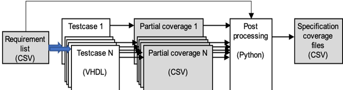

   Specification Coverage workflow

|

Simplest possible usage, with a single testcase
=================================================================================================================================
For any FPGA / ASIC it is always important to properly specify the design requirements and check that they have all been tested. 
Normally it is often just ticked off somewhere that a particular requirement is tested – often only once during the development phase, 
and sometimes just as a mental exercise. It is always better to use a written, repeatable and automated approach. This VIP 
significantly simplifies such an approach. 

When feasible, the simplest structured approach would be to test all requirements in one single self-checking testcase. If so - all you 
want to do is the following - as illustrated in the diagram below:

#. List all DUT requirements in a requirement list CSV file. (RL). This could mean anything from just writing down the requirements
   directly, to a fully automated requirement extraction from an existing Requirement Specification.
   NOTE: For specification coverage this list is mandatory, but a simplified mode of pure test reporting without the need for a prior 
   listing of the requirements is available (see more info in `Shortcut with no requirement list`_ ).

#. Implement your testcase :samp:`(T)` with all tests required to verify the DUT.  (see `VHDL Methods`_)
   The test sequencer should initiate coverage using initialize_req_cov() :samp:`(T1)`, then for each verified requirement call 
   tick_off_req_cov() :samp:`(T2)` and then finalise coverage reporting using finalize_req_cov() :samp:`(T3)`.

#. When the testcase is executed (run), initialize_req_cov() :samp:`(T1)` (see `VHDL Methods`_) will read the given requirement list 
   file (RL), the new partial coverage file :samp:`(PC)` is created, and the testcase name is stored. The header of the partial 
   coverage file - with NOTE, testcase-name and delimiter is written. The header is not shown in any of the examples, but is shown in 
   the file formats in the section `Formats of Input and Intermediate Files`_
   Then for each tick_off_req_cov() :samp:`(T2)` a separate line is written into the partial coverage file with a) the given 
   requirement label, b) the name of the testcase, and c) the result of the test. The result of the test will be PASS - unless marked 
   as FAIL in the procedure call or unexpected serious alerts (>= ERROR / TB_ERROR) have occurred, in which case it will be marked as 
   FAIL. 
   Finally when finalize_req_cov() :samp:`(T3)` is executed, a closing check of the alert counters is made. If ok, then 
   'SUMMARY, <Testcase name>, PASS' is written at the end of the Partial coverage file. Otherwise FAIL rather than PASS 
   (provided testcase does not stop on the alert). If a testcase fails before reaching finalize_req_cov(), then no SUMMARY line will 
   be written. This is interpreted as FAIL. Note that a given requirement may be tested and reported several times, so that for 
   instance UART_REQ_3 may be listed multiple times in the Partial coverage file :samp:`(PC)`.    
#. After the testcase has been executed, the overall Specification coverage :samp:`(SC)` can be found by executing the Python script 
   run_spec_cov.py (see `Post-processing script`_). This script traverses the requirement list (RL) and Partial coverage file  
   :samp:`(PC)` and from that generates the specification coverage :samp:`(SC)`.
   Each requirement is listed in the specification coverage file. If a requirement has one or more FAIL in a Partial coverage file, 
   the result is NON_COMPLIANT for that requirement.
   For a simple scenario with a single testcase, the partial coverage :samp:`(PC)`  file and the specification coverage file 
   :samp:`(SC)` yield the same information, but the specification coverage potentially with fewer lines.

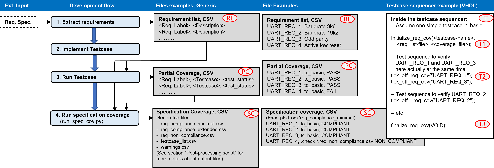

|

**********************************************************************************************************************************
Simple usage
**********************************************************************************************************************************

Shortcut with no requirement list
=================================================================================================================================
A shortcut is supported to allow all tested requirements to be reported to the Partial coverage file - without the need for a prior
listing of the requirements. This shortcut does of course not yield any specification coverage, as no specification is given, but could
be useful for scenarios or early testing where only a list of executed tests is wanted. This shortcut mode is automatically applied
when no requirement list is provided as an input to the initialize_req_cov() VHDL command in the test sequencer. If so, the partial
coverage files will be generated, but no specification coverage file (the Python script) shall be run.

Simple usage, with multiple testcases
=================================================================================================================================
Many verification systems will have multiple testcases per DUT. If so, the above simplest approach is not possible. However, if your
tests are split on multiple testcases, but with no requirement as to which testcase tests what, then you can apply almost the same
simple approach as the simplest case above.

For this scenario, there will be two or more testcases, and so you will have to run all relevant testcases. There will of course still
be only a single Requirement list. For every single testcase the same set of commands will be applied - with initialize_req_cov(), one
or more tick_off_req_cov(), and finalize_req_cov(). The only thing to remember here is that initialize_req_cov() has to specify
separate Partial coverage files for each testcase. Hence, after simulation you should end up with as many Partial coverage files as
testcases

Note: it is possible inside a test sequencer to execute initialize_req_cov() multiple times, but only when the previous
initialize_req_cov() has been terminated with finalize_req_cov().  If multiple initialize… & finalize… these should operate on
different partial coverage files to avoid overwriting the previous section.
  
The Python script run_spec_cov.py will be run in the same way as before, but needs to be given a list of all the relevant Partial
coverage files. Then the Specification coverage is generated exactly as before.

Multiple testcases, with strict requirement vs testcase relation
=================================================================================================================================
For most applications where high quality and confidence is required it is mandatory to specify up front in which testcase a given
requirement will be tested. In these cases, the requirement list must be extended to include the testcase in which a requirement will
be tested, - as shown below. The example now shows more testcases than just tc_basic. 

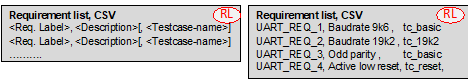

Specifying a testcase name in the requirement list will however not force a requirement vs testcase check by itself. In order to check
that a requirement is tested in the specified testcase the switch '-strictness 1' must be used when calling run_spec_cov.py (see 
`Strictness levels`_). If strictness is set to 1 then for example the requirement 'UART_REQ_3, Odd parity, tc_basic will be: 

| a) Marked as COMPLIANT in the specification coverage file if UART_REQ_3 is checked positive in testcase tc_basic. UART_REQ_3 may 
  additionally also be checked elsewhere. 

| b) Will be marked as NOT_TESTED in the specification coverage file if UART_REQ_3 is not checked in testcase tc_basic 
  (but for instance only in tc_19k2).

Default strictness is -strictness 0, i.e. neither of the above strict checking.  See the section about `Strictness levels`_ for 
various strictness settings.

Testcase names and Requirement labels are not case sensitive for any comparison. For any output report the names and labels from the
requirement list will be used if available. If not provided via the requirement list, then testcase name is taken from the
initialize_req_cov() and the requirement label from the tick_off_req_cov(). 

|

**********************************************************************************************************************************
Advanced usage
**********************************************************************************************************************************

Only one of multiple testcases for a given requirement must pass
=================================================================================================================================
In the previous example all tests in all testcases had to pass for the overall specification coverage to pass. There may however be
situations where a given requirement is tested in multiple testcases and it is sufficient that only any one of these pass - given of
course that none of the others have failed, but just haven’t been executed. A fail in any executed testcase will always result in a
summary fail. This approach could for instance be used to qualify for a lab test release. A requirement for this approach to work is to
remove all old partial coverage files before running your test suite generating new partial coverage files. The run_spec_cov.py option
-clean may be used for this.  

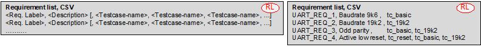

The example above shows that UART_REQ_3 is covered by both testcases tc_basic and tc_19k2, and that UART_REQ_4 may in fact be tested by
any of the three testcases.

This example also shows that testcase tc_reset is not required to be executed in order for all requirements to be tested. This *could*
be a sign that tc_reset should be removed (optimized away), but given that tc_reset is required for some special reason, then it could
for instance be left out of from a reduced test suite to qualify for lab test only.

|

All (or some) of multiple testcases for a given requirement must pass
=================================================================================================================================

This is basically the opposite of the above and is easy to achieve by just adding lines in the requirement list for all wanted
combinations of requirements and testcases. The example below states that UART_REQ_3 must pass in both tc_basic and tc_19k2.

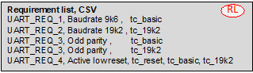

|

Requirement mapping
=================================================================================================================================
Requirement mapping just maps one or more requirements to another requirement. This is intended for two different use cases: Mapping of
project requirements to IP or legacy requirements or mapping of requirements to multiple sub-requirements. 

Mapping of project requirements to IP or legacy requirements
---------------------------------------------------------------------------------------------------------------------------------
Assuming you already have a UART IP, that has been properly verified, and the provided UART testbench already has full UVVM
specification coverage support, with a requirement list file and testcases generating Partial coverage files. Assuming you then have a
project with its own UART requirements, that hopefully more or less matches that of the IP, but the requirement labels and combinations
may be different. Then you don' want to modify the provided UART testbench in order just to get the “right” requirement labels. A much
better approach is to map the project requirements to the UART IP requirements.

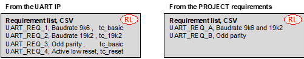

Now assume the already shown UART requirement list is that of the IP, and that we have similar project UART requirements, we may have a
scenario as shown above. Here we can see that UART_REQ_B of the project matches that of UART_REQ_3 of the UART IP, and that UART_REQ_A
of the project is actually not covered by any single UART IP requirement, but in fact must include both UART_REQ_1 and UART_REQ_2. The
map would for this case be as shown below.

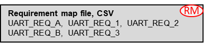

Making the requirement map file is of course a manual job, which could be simple or complex depending on how much the two requirement
lists differ in structure.

The requirement map file is only used as an input to the run_spec_cov.py Python script, as is also the Partial coverage file from the
UART IP verification using the IP (or legacy) testbench. The Python script will check that -	For project requirement UART_REQ_A,
both UART_REQ_1 and UART_REQ_2 have passed -	For project requirement UART_REQ_B, UART_REQ_3 has passed -	Etc…

The report from run_spec_cov.py will show compliancy for the project requirement (e.g.UART_REQ_A), but also for the
“sub-requirement(s)” (e.g. UART_REQ_1 and UART_REQ_2).

Mapping of project requirements to multiple sub-requirements
---------------------------------------------------------------------------------------------------------------------------------

Often the original requirements are too complex (or compound), so that it is difficult to tick off a requirement as checked until a
whole lot of different things are tested. An example of that could be a UART requirement like the one shown below - with a single
UART_REQ_GENERAL requirement. 

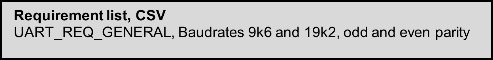

If you want to split this into more specific requirements you have several options, with some potential options listed and illustrated
below. a)	Rename the requirements b)	Extend the names c)	Extend the names using a record like notation

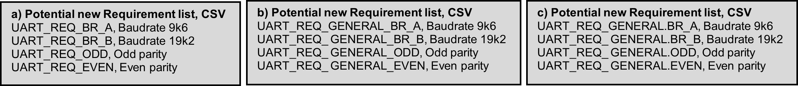

All of these and more are of course possible, but the problem is that they don't show the relation to the original requirement.

Showing this relationship is quite simple in UVVM, by using exactly the same mechanism as for the IP or legacy scenario in the previous
example. Thus all you have to do is to make your own requirement list and then map the original requirement to a set of requirements in
your new list.

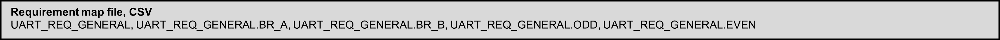

- Or even simpler just name the subrequirements A,B,C,…. 

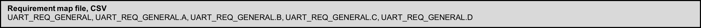

 
As for the IP scenario this approach allows the report to show both the original requirement and its new sub-requirements.

|

**********************************************************************************************************************************
Requirement and map files
**********************************************************************************************************************************

The requirement list file contains a list of requirements to be verified. As described in the section about `Mapping of project
requirements to multiple sub-requirements`_, some requirements from the specification may not be practical or possible to test
directly, and might therefore need to be divided into testable sub-requirements. This relationship between super- and sub-requirements
is defined in the requirement map file. 

See the section `Formats of input and intermediate files`_ for more information about the syntax of the requirement- and map files.

.. note::

    If tickoff is done on a requirement that was not listed in the requirement list, a TB_WARNING will be issued during simulation.
    However, the requirement will still be included in the partial coverage file. The final compliance of the requirement will depend
    on the strictness level specified when running the run_spec_cov.py post-processing script.

|

Comments
=================================================================================================================================
Any line in the requirement- or map files beginning with '#' will be treated as a comment, meaning it will be ignored by the VHDL and
python scripts. Note that in-line comments are not supported. 

Example of valid and invalid usage in requirement list file:

.. code-block:: none

    # This line will be treated as a comment
    REQ_1, Description 1, TC_1
    REQ_2, Description 2, TC_2 # This will NOT be interpreted as a comment!

|

**********************************************************************************************************************************
VHDL Package
**********************************************************************************************************************************
A vital part of the specification coverage concept is the VHDL testbench methods. These methods are described in the following section.
The methods are located inside the spec_cov_pkg.vhd file in the src/ directory of this VIP. 

VHDL Methods
=================================================================================================================================

initialize_req_cov()
---------------------------------------------------------------------------------------------------------------------------------
This procedure starts the requirement coverage process in a testcase. 

The requirement list file is optional, but without it the specification coverage is of course not possible and run_spec_cov.py shall
not be executed.

The partial_coverage_file is created - and the header is written with NOTE, Testcase-name and Delimiter on the first three lines. If
file already exists, it will be overwritten. ::

    initialize_req_cov(testcase, [req_list_file], partial_cov_file)

+----------+--------------------+--------+------------------------------+---------------------------------------------------------+
| Object   | Name               | Dir.   | Type                         | Description                                             |
+==========+====================+========+==============================+=========================================================+
| constant | testcase           | in     | string                       | Testcase name.                                          |
+----------+--------------------+--------+------------------------------+---------------------------------------------------------+
| constant | req_list_file      | in     | string                       | Optional: Requirement list file name.                   |
+----------+--------------------+--------+------------------------------+---------------------------------------------------------+
| constant | partial_cov_file   | in     | string                       | Partial coverage output file name.                      |
+----------+--------------------+--------+------------------------------+---------------------------------------------------------+

.. code-block:: 

    -- Example:
    initialize_req_cov("TC_UART_9k6", "c:/my_folder/requirements.csv", "./cov_9k6.csv");
    initialize_req_cov("TC_UART_9k6", "requirements.csv", "cov_9k6.csv");

tick_off_req_cov()
---------------------------------------------------------------------------------------------------------------------------------
This procedure evaluates and logs the specified requirement. The procedure checks the global alert mismatch status, and if an alert
mismatch is present on ERROR, FAILURE, TB_ERROR or TB_FAILURE the requirement will be marked as FAIL. If there are no such alert
mismatches, the requirement will be marked as PASS, unless the requirement_status is explicitly set to FAIL. The result is written to
both the transcript (and log) and the partial coverage file (specified in the initialize_req_cov() command). The tick_off_req_cov()
will look up the specified requirement and testcase in the requirement list specified in initialize_req_cov(), and use the description
from this entry as a minimum log message. The procedure will also issue a TB_WARNING if the specified requirement was not found in the
requirement list. ::

.. note::

    If tickoff is performed on a requirement that was not listed in the requirement list, a TB_WARNING will be issued. However, the
    requirement will still be included in the partial coverage file. The final compliance of the requirement will depend on the
    strictness level specified when running the run_spec_cov.py script.

|

    tick_off_req_cov(requirement, [requirement_status], [msg], [tickoff_extent], [scope])

+----------+-------------------+------------------------+---------------------------------------------------------------+
| Object   | Name              | Type                   | Description                                                   |
+==========+===================+========================+===============================================================+
| constant | requirement       | string                 | String with the requirement label. Must as default            |
|          |                   |                        | match a requirement label in the given requirement list.      |
+----------+-------------------+------------------------+---------------------------------------------------------------+
| constant | requirement_status| t_test_status          | Optional: Enter FAIL to explicitly fail the requirement.      |
+----------+-------------------+------------------------+---------------------------------------------------------------+
| constant | msg               | string                 | Optional message. Only possible after preceding               |
|          |                   |                        | requirement_status (use NA unless FAIL).                      |
+----------+-------------------+------------------------+---------------------------------------------------------------+
| constant | tickoff_extent    | t_extent_tickoff       | Optional: Partial coverage output file name.                  |
+----------+-------------------+------------------------+---------------------------------------------------------------+
| constant | scope             | string                 | Optional: Partial coverage output file name.                  |
+----------+-------------------+------------------------+---------------------------------------------------------------+

.. code-block:: 

    -- Examples:
    -- Will pass if no unexpected alert occurred
    tick_off_req_cov("UART_REQ_1");

    -- Will fail since passed argument is set to false
    tick_off_req_cov("UART_REQ_1", FAIL);

    -- In order to include msg and scope requirement_status and tickoff_extent must be included
    tick_off_req_cov("UART_REQ_1", NA, "my_msg");
    -- or 
    tick_off_req_cov"“UART_REQ_1", NA, "my_msg", LIST_EVERY_TICKOFF, "my_scope");

finalize_req_cov()
---------------------------------------------------------------------------------------------------------------------------------
This procedure ends the requirement coverage process in a test. 
If alert status is OK - it appends the following line to the partial coverage file: 'SUMMARY, <Testcase name>, PASS'
If alert status is not OK - it appends the following line to the partial coverage file: 'SUMMARY, <Testcase name>, FAIL'
This line is used later by the run_spec_cov.py script.
•	If the simulation never reached this command, e.g. if failed, then no summary line is written - indicating FAIL::

    finalize_req_cov(VOID)

.. code-block:: 

    -- Example:
    finalize_req_cov(VOID);

cond_tick_off_req_cov()
---------------------------------------------------------------------------------------------------------------------------------
This procedure will tick off the specified requirement in the same way as tick_off_req_cov(), except that any requirement disabled for
conditional tick off (through the disable_cond_tick_off_req_cov() procedure) will be ignored (no tick off will be performed).

Note 1: All requirements are by default enabled for conditional tick off, i.e. will act as being called using the tick_off_req_cov()
procedure. ::

    cond_tick_off_req_cov(requirement, [requirement_status], [msg], [tickoff_extent], [scope])

+----------+-------------------+------------------------+---------------------------------------------------------------+
| Object   | Name              | Type                   | Description                                                   |
+==========+===================+========================+===============================================================+
| constant | requirement       | string                 | String with the requirement label. Must as default            |
|          |                   |                        | match a requirement label in the given requirement list.      |
+----------+-------------------+------------------------+---------------------------------------------------------------+
| constant | requirement_status| t_test_status          | Optional: Enter FAIL to explicitly fail the requirement.      |
+----------+-------------------+------------------------+---------------------------------------------------------------+
| constant | msg               | string                 | Optional message. Only possible after preceding               |
|          |                   |                        | requirement_status (use NA unless FAIL).                      |
+----------+-------------------+------------------------+---------------------------------------------------------------+
| constant | tickoff_extent    | t_extent_tickoff       | Partial coverage output file name.                            |
+----------+-------------------+------------------------+---------------------------------------------------------------+
| constant | scope             | string                 | Partial coverage output file name.                            |
+----------+-------------------+------------------------+---------------------------------------------------------------+

disable_cond_tick_off_req_cov()
---------------------------------------------------------------------------------------------------------------------------------
This procedure prevents the given requirement from being ticked off in the partial coverage file when ticked off using the
cond_tick_off_req_cov() procedure.

Note 1: The regular tick_off_req_cov() procedure is not affected by this disabling.
Note 2: A TB_WARNING is raised if the requirement:
•	Is not listed in the requirement file.
•	Has already been disabled from conditional tick off.::

    disable_cond_tick_off_req_cov(requirement)

+----------+--------------------+--------+------------------------------+---------------------------------------------------------+
| Object   | Name               | Dir.   | Type                         | Description                                             |
+==========+====================+========+==============================+=========================================================+
| constant | requirement        | in     | string                       | Requirement to be disabled from conditional tickoff     |
+----------+--------------------+--------+------------------------------+---------------------------------------------------------+

.. code-block:: 

    -- Example:
    disable_cond_tick_off_req_cov("UART_REQ_1");

enable_cond_tick_off_req_cov()
---------------------------------------------------------------------------------------------------------------------------------
This procedure permit the requirement to be ticked off in the partial coverage file when ticked off using cond_tick_off_req_cov()
procedure.

Note 1: All requirements are by default enabled for conditional requirement tick off.
Note 2: A TB_WARNING is raised if the requirement: 
•	Is not listed in the requirement file.
•	Has not previously been disabled from conditional tick off.::

    enable_cond_tick_off_req_cov(requirement)

+----------+--------------------+--------+------------------------------+---------------------------------------------------------+
| Object   | Name               | Dir.   | Type                         | Description                                             |
+==========+====================+========+==============================+=========================================================+
| constant | requirement        | in     | string                       | Requirement to be permitted for conditional tickoff     |
+----------+--------------------+--------+------------------------------+---------------------------------------------------------+

.. code-block:: 

    -- Example:
    enable_cond_tick_off_req_cov("UART_REQ_1");

|

Specification Coverage configuration record: shared_spec_cov_config
=================================================================================================================================

This record is located in the local adaptation package 'bitvis_vip_spec_cov/src/local_adaptations_pkg.vhd' The configuration record is
applied as a shared_variable 'shared_spec_cov_config' to allow different configuration for different DUTs. Any test sequencer may then
set the complete record as required - or even just parts of it like shared_spec_cov_config.csv_delimiter := ';';

+---------------------------+------------------+------------+----------------------------------------------------------+
|      Record elements      |       Type       | Default    |                    Description                           |
+===========================+==================+============+==========================================================+
| missing_req_label_severity| t_alert_level    | TB_WARNING | Alert level used when the tick_off_req_cov() procedure   |
|                           |                  |            | does not find the specified requirement label in the     |
|                           |                  |            | requirement list, given that a requirement list is given |
|                           |                  |            | in the initialize_req_cov() command.                     |
+---------------------------+------------------+------------+----------------------------------------------------------+
| csv_delimiter             | character        | ','        | Character used as delimiter in the CSV files. This will  |
|                           |                  |            | also be written into all partial coverage files.         |
|                           |                  |            | run_spec_cov.py will find the delimiter there.           |
|                           |                  |            | NOTE: The '&' and ' ' (space) symbols can not be used as |
|                           |                  |            | delimiter.                                               |
+---------------------------+------------------+------------+----------------------------------------------------------+
| max_requirements          | natural          | 1000       | Maximum number of requirements in the req_map file used  |
|                           |                  |            | in initialize_req_cov(). Increase this number if the     |
|                           |                  |            | number of requirements exceeds 1000.                     |
+---------------------------+------------------+------------+----------------------------------------------------------+
| max_testcases_per_req     | natural          | 20         | Maximum number of testcases allowed per requirement.     |
|                           |                  |            | This is applicable when one requirement is verified by   |
|                           |                  |            | one or more testcases.                                   |
+---------------------------+------------------+------------+----------------------------------------------------------+
| csv_max_line_length       | positive         | 256        | Maximum length of each line in any CSV file. (i.e. max   |
|                           |                  |            | number of characters for all values and separators in    |
|                           |                  |            | total)                                                   |
+---------------------------+------------------+------------+----------------------------------------------------------+

The specification coverage implementation uses three new message IDs, as described in the table below. All message Ids are located in
uvvm_util adaptations package. The specification coverage implementation uses the shared message id panel for all logging.

+--------------------+-----------------------------------------------------------------------+
| Message Id         | Description                                                           |
+====================+=======================================================================+
| ID_FILE_OPEN_CLOSE | Id used for any file open and close operation                         |
+--------------------+-----------------------------------------------------------------------+
| ID_FILE_PARSER     | Id used for CSV parser messages.                                      |
+--------------------+-----------------------------------------------------------------------+
| ID_SPEC_COV        | Id used for all messages that are not directly related to CSV parsing.|
+--------------------+-----------------------------------------------------------------------+

|

Additional documentation
=================================================================================================================================

Additional documentation about UVVM and its features can be found under "/uvvm_vvc_framework/doc"

Compilation
---------------------------------------------------------------------------------------------------------------------------------
This VHDL package may only be compiled with VHDL 2008. It is dependent on the following libraries
•	UVVM Utility Library (UVVM-Util), version 2.19.5 and up
•	UVVM VVC Framework, version 2.12.7 and up

Before compiling the Specification Coverage component, make sure that uvvm_vvc_framework and uvvm_util have been compiled.
See UVVM Essential Mechanisms located in uvvm_vvc_framework/doc for information about compile scripts.

+----------------------+---------------------------+----------------------------------------------------+
| Compile to library   |          File             |                   Comment                          |
+======================+===========================+====================================================+
| bitvis_vip_spec_cov  | local_adaptations_pkg.vhd | Local file for user adaptations                    |
+----------------------+---------------------------+----------------------------------------------------+
| bitvis_vip_spec_cov  | csv_file_reader_pkg.vhd   | Package for reading and parsing of CSV input files |
+----------------------+---------------------------+----------------------------------------------------+
| bitvis_vip_spec_cov  | spec_cov_pkg.vhd          | Specification Coverage component implementation    |
+----------------------+---------------------------+----------------------------------------------------+

Simulator compatibility and setup
---------------------------------------------------------------------------------------------------------------------------------
See UVVM/README.md for a list of supported simulators.
For required simulator setup see UVVM-Util Quick reference.

|

**********************************************************************************************************************************
Post-processing script
**********************************************************************************************************************************

The final step of the Specification Coverage usage is to run a post-processing script to evaluate all the simulation results. This
script is called run_spec_cov.py. The script requires Python 3.x. The script can be called with the arguments listed in the table below
from the command line. The CSV delimiter is fetched by the Python script from the partial coverage file headers.

*Note 1: All files may be referenced with absolute paths or relative to working directory.*

.. _script_arguments_table:

.. list-table:: run_spec_cov.py script arguments
   :header-rows: 1
   :widths: 20 40 70

   * - Argument
     - Example
     - Description
   * - --requirement_list (-r)
     - --requirement_list path/requirements.csv
     - Points to the requirement list. Mandatory. (This script is not used when running spec. cov. without a requirement list)
   * - --partial_cov (-p)
     - --partial_cov my_testcase_cov.csv
       
       --partial_cov my_coverage_files.txt
     - Points to the partial coverage file generated by the VHDL simulation as input to the post processing.
       
       May also point to a file list including references to multiple partial coverage files. The format of such a file would be just
       
       each file on a separate line - potentially prefixed by a relative or absolute path.
   * - --requirement_map_list (-m)
     - --requirement_map_list path/subrequirements.csv
     - Optional: Points to the requirement map file, (see `Requirement mapping`_). If this argument is omitted, the
       
       script assumes that no sub-requirements exist.
   * - --spec_cov (-s)
     - --spec_cov uart_spec_cov.csv
     - Name (and optional path) of the specification_coverage file name, which is used to generate the following 3 files:
       
       • <specification_coverage_file_name>.req_vs_single_tc.csv
       
       • <specification_coverage_file_name>.tc_vs_reqs.csv
       
       • <specification_coverage_file_name>.req_vs_tcs.csv
       
       Note that the filename extension, i.e. .csv, will have to be part of the specified specification_coverage file name.
   * - --clean
     - --clean path/do/directory
     - Will clean any/all partial coverage files in the given directory. Directory path is optional. Default is current directory.
       
       Cannot be run in combination with other arguments. No short form defined here - to avoid unwanted clean.
   * - --strictness
     - --strictness 1
     - Default strictness is 0 (when not applied). 1 is stricter and 2 is much stricter (see `Strictness levels`_ and `Multiple
       testcases, with strict requirement vs testcase relation`_)).
       
       No short form defined here - to avoid wrong strictness.
   * - --config
     - --config path/config_file.txt
     - Optional configuration file where all the arguments can be placed. This argument will override all other arguments.
       
       The configuration file does not need to have the .txt extension. All arguments shall be added on a new line.
       
       Example configuration file contents:
       
       --requirement_list my_path/requirements.csv
       
       --partial_cov my_testcase_cov_files.txt
       
       --spec_cov my_spec_cov.csv
   * - --help (-h)
     - --help
     - Display the script argument options.

|

Strictness levels
=================================================================================================================================
Strictness does not apply to VHDL testcases - only to the post processing Python script.
For all strictness levels, all requirements must be compliant for the complete specification to be compliant.
Default strictness is strictness 0.

Strictness 0
---------------------------------------------------------------------------------------------------------------------------------
This is the least strictness possible. Focus is only on the requirements, - with no concern at all as to in which testcase the various
requirements have been tested. Any requirement is compliant if executed as PASSed in any passing testcase, and not failing anywhere.
This is independent of whether one or more testcases are specified for a given requirement in the Requirement list. 

Strictness 1
---------------------------------------------------------------------------------------------------------------------------------
For this strictness level a requirement is only compliant if executed in the testcase(s) specified in the Requirement list. The list
shown here is used as example for the cases below:

-	If no testcase is specified for a given requirement, this requirement may be checked anywhere. Compliant if PASSed.
-	If a requirement line is specified with a single testcase, this requirement (e.g. UART_REQ_1) is only compliant if executed by that
 	testcase.
-	If a requirement line is specified with multiple testcases (e.g. UART_REQ_4), this requirement is compliant if PASS in one or more
 	of these testcases. There can be no FAIL in other testcases.
-	If a requirement line is specified multiple times (like UART_REQ_3), every single line is mandatory. Hence UART_REQ_3 must PASS in
 	both testcases (tc_basic and tc_19k2)

- A requirement may be checked in **any** testcase in addition to any specified testcase(s).
- **If a requirement status from any testcase is FAIL, that requirement is NON COMPLIANT, - even if PASS in other testcases.** 

.. code-block:: none

    UART_REQ_1, Baudrate 9k6, tc_basic
    UART_REQ_2, Baudrate 19k2, tc_19k2
    UART_REQ_3, Odd parity, tc_basic
    UART_REQ_3, Odd parity, tc_19k2
    UART_REQ_4, Active low reset, tc_reset, tc_basic, tc_19k2

Strictness 2
---------------------------------------------------------------------------------------------------------------------------------
With this strictness a requirement will be NON_COMPLIANT if it is tested (ticked off) in a testcase that in the Requirement list was
not specified as testcase for that requirement. In that case it will be NON_COMPLIANT even if it has passed in one or more testcases
specified for that requirement. E.g. if UART_REQ_1 is tested in testcase tc_basic, but also in tc_reset.

.. note::

    Strictness 2 requires that all requirements must be specified with at least one testcase.

|

Output files
=================================================================================================================================

The output of the post-processing script is five files with requirements and testcases listed as
COMPLIANT/NON_COMPLIANT/NOT_TESTED/TESTED_OK and PASS/FAIL/NOT_EXECUTED, respectively. This section lists the formats of the output
files.

Requirement vs. testcase listing
---------------------------------------------------------------------------------------------------------------------------------

.req_vs_tcs.csv
.................................................................................................................................
The <spec_cov_file>.req_vs_tcs.csv file will list each requriement once, with all associated testcases listed on the same line.
Associated testcases include testcases specified for that requirement and/or testcases in which the requirement was ticked off. 

Example:

.. code-block:: none

    Requirement,Testcase(s),Compliance
    REQ_1,TC_1,COMPLIANT
    REQ_2,TC_1 & TC_2,NOT_TESTED
    REQ_3,TC_1 & TC_3,COMPLIANT
    REQ_5A,TC_1,COMPLIANT
    REQ_5B,TC_1,COMPLIANT
    REQ_6,TC_1,COMPLIANT

    Requirement,Sub-Requirement(s),Compliance
    REQ_5,REQ_5B & REQ_5B,COMPLIANT

    Not listed requirement(s)
    REQ_6

.req_vs_single_tc.csv
.................................................................................................................................
The <spec_cov_file>.req_vs_single_tc.csv file will list the status of each requirement/testcase pair on a separate line, so that a
requirement with multiple associated testcases will have a separate listing for each of those testcases. 

In strictness 1, if a requirement is COMPLIANT, requirement/testcase listings for testcases NOT specified for that requirement will not
be listed. If a requirement was not tested in any of its specified testcase(s), but was tested in another, passing testcase, the
requirement will be listed as TESTED_OK in the non-specified testcase, and as NOT_TESTED in the specified testcase(s).

Example:

.. code-block:: none

    Requirement,Testcase,Compliance
    REQ_1,TC_1,COMPLIANT
    REQ_2,TC_1,TESTED_OK
    REQ_2,TC_2,NOT_TESTED
    REQ_3,TC_3,COMPLIANT
    REQ_5A,TC_1,COMPLIANT
    REQ_5B,TC_1,COMPLIANT
    REQ_6,TC_1,COMPLIANT

    Requirement,Sub-Requirement(s),Compliance
    REQ_5,REQ_5B & REQ_5B,COMPLIANT

    Not listed requirement(s)
    REQ_6

.single_req_vs_single_tc.csv
.................................................................................................................................
The <spec_cov_file>.single_req_vs_single_tc.csv file will list each requirement once, with a single testcase in which the requirement
has been tested (if any).

Example:

.. code-block:: none

    Requirement,Testcase,Compliance
    REQ_1,TC_1,COMPLIANT
    REQ_2,TC_1,NOT_TESTED
    REQ_3,TC_1,COMPLIANT
    REQ_5A,TC_1,COMPLIANT
    REQ_5B,TC_1,COMPLIANT
    REQ_6,TC_1,COMPLIANT

    Requirement,Sub-Requirement(s),Compliance
    REQ_5,REQ_5B & REQ_5B,COMPLIANT

    Not listed requirement(s)
    REQ_6

Testcase vs. requirement listing
---------------------------------------------------------------------------------------------------------------------------------

.tc_vs_reqs.csv
.................................................................................................................................
The <spec_cov_file>.tc_vs_reqs.csv file will list each testcase with all the requirements that were ticked off in that testcase. 

.. code-block:: none

    Testcase,Requirement(s),Result
    TC_1,REQ_1 & REQ_2 & REQ_3 & REQ_5A & REQ_5B & REQ_6,PASS
    TC_3,REQ_3,PASS
    TC_2,REQ_2,NOT_EXECUTED

.single_tc_vs_single_req.csv
.................................................................................................................................
The <spec_cov_file>.single_tc_vs_single_req.csv file will list each testcase with one of the requirements that was ticked off in that
testcase (if any). 

.. code-block:: none

    Testcase,Requirement,Result
    TC_1,REQ_1,PASS
    TC_3,REQ_3,PASS
    TC_2,,NOT_EXECUTED

Reference tables: Compliance/result labels
---------------------------------------------------------------------------------------------------------------------------------
The following tables summarize the meanings of the various requirement compliance and testcase result labels in the specificiation
coverage output files. 

+------------------+------------------------+-------------------------------------+--------------------------------------------+
| Requirement      | Meaning when           | Meaning when                        | Meaning when                               |
| compliance label | Strictness = 0         | Strictness = 1                      | Strictness = 2                             |
+==================+========================+=====================================+============================================+
| COMPLIANT        | Ticked off in passing  | Ticked off in specified, passing    | Ticked off ONLY in specified, passing      |
|                  | testcase(s). No fails. | testcase(s).                        | testcase(s).                               |
+------------------+------------------------+-------------------------------------+--------------------------------------------+
| NON-COMPLIANT    | Ticked off in failing testcase and/or explicitly failed      | Ticked off in failing testcase and/or      |
|                  | at tickoff.                                                  | explicitly failed at tickoff and/or ticked |
|                  |                                                              | off in non-specified testcase.             |              
+------------------+------------------------+-------------------------------------+--------------------------------------------+
| NOT_TESTED       | Not ticked off in any  | Not ticked off in any specified     | Not ticked off in any testcase.            |
|                  | testcase.              | testcase.                           |                                            |                     
+------------------+------------------------+-------------------------------------+--------------------------------------------+
| TESTED_OK        | --                     | Ticked off in the indicated, passing| --                                         |
|                  |                        | testcase, but that testcase was     |                                            |
|                  |                        | not specified for the requirement.  |                                            | 
|                  |                        | **NOTE:** Only used in              |                                            |
|                  |                        | .req_vs_single_tc.csv output file.  |                                            |                                      
+------------------+------------------------+-------------------------------------+--------------------------------------------+

+------------------------+--------------------------------------------+
| Testcase result label  | Meaning                                    |
+========================+============================================+
| PASS                   | Testcase passed without unexpected alerts  | 
|                        |                                            |
+------------------------+--------------------------------------------+
| FAIL                   | Testcase failed                            | 
|                        |                                            |
+------------------------+--------------------------------------------+                          
| NOT_EXECUTED           | Testcase not executed                      |                                     
+------------------------+--------------------------------------------+

|

**********************************************************************************************************************************
Quick reference
**********************************************************************************************************************************

VHDL procedure calls
=================================================================================================================================

The following table shows the specification coverage procedures used in the VHDL testcase.

.. list-table::
   :widths: 25 25 50
   :header-rows: 1

   * - **Procedure**
     - **Parameters**
     - **Examples**
   * - **initialize_req_cov()**
     - testcase (string), req_list_file (string), partial_cov_file (string)
       testcase (string), partial_cov_file (string)    

       (Note: No spec coverage)
     - initialize_req_cov(“tc_base_func”, “uart_req_list.csv”, “base_func_cov.csv”);

       initialize_req_cov(“tc_base_func”, “base_func_cov.csv”); 
   * - **tick_off_req_cov()**
     - requirement (string) [,FAIL (t_test_status) [, msg [, LIST_SINGLE_TICKOFF (t_extent_tickoff) [, scope]]]]
     - tick_off_req_cov(“UART_REQ_4”);

       tick_off_req_cov(“UART_REQ_4”, PASS, “Monitor”, LIST_SINGLE_TICKOFF);
   * - **finalize_req_cov()**
     - VOID
     - finalize_req_cov(VOID);
   * - **cond_tick_off_req_cov()**
     - requirement (string) [,FAIL (t_test_status) [, msg [, LIST_SINGLE_TICKOFF (t_extent_tickoff) [, scope]]]]
     - cond_tick_off_req_cov(“UART_REQ_4”);
       cond_tick_off_req_cov(“UART_REQ_4”, PASS, “Monitor”, LIST_SINGLE_TICKOFF);
   * - **disable_cond_tick_off_req_cov()**
     - requirement (string)
     - disable_cond_tick_off_req_cov(“UART_REQ_4”);
   * - **enable_cond_tick_off_req_cov()**
     - requirement (string)
     - enable_cond_tick_off_req_cov(“UART_REQ_4”);

Script Usage - run_spec_cov.py
=================================================================================================================================
Call the run_spec_cov.py from a terminal, using e.g.:      python run_spec_cov.py <see script_arguments_table_ for script arguments>

Formats of Input and Intermediate Files
=================================================================================================================================

Requirement list file
---------------------------------------------------------------------------------------------------------------------------------
The requirement list file is a CSV type file used as input both in the VHDL testcase and to the run_spec_cov.py script. 

============== ===========================================================================
**File**       Requirement list file
**Required?**  Required
**File type**  CSV
**Input to**   | run_spec_cov.py (-r <req-list>.csv)
               | VHDL testcase (initialize_req_cov(<tc_name>, **<req_list>**, <pc_name>))
============== ===========================================================================

Syntax:

.. code-block:: none

    <Req. label>, <Descripton>[,<Testcase-name>, <Testcase-name>, ...]
    <Req. label>, <Descripton>[,<Testcase-name>, <Testcase-name>, ...]

Example:

.. code-block:: none

    UART_REQ_BR_A,  Baudrate 9k6,     tc_basic
    UART_REQ_BR_B,  Baudrate 19k2,    tc_19k2
    UART_REQ_ODD,   Odd parity,       tc_basic
    UART_REQ_RESET, Active low reset, tc_reset, tc_basic

Requirement map file (optional)
---------------------------------------------------------------------------------------------------------------------------------
The requirement map file is an optional CSV type file used as input to the run_spec_cov.py script. This file maps super-requirements to
testable sub-requirements. A super-requirements is compliant if and only if all of it's sub-requirements are compliant.

============== =====================================
**File**       Requirement map file
**Required?**  Optional
**File type**  CSV
**Input to**   run_spec_cov.py (-m <map_file>.txt)
============== =====================================

Syntax:

.. code-block:: none

    <Req. label>, <Sub-req. label> [,<Sub-req. label>, <Sub-req. label>, ...]
    <Req. label>, <Sub-req. label> [,<Sub-req. label>, <Sub-req. label>, ...]

Example:

.. code-block:: none

    UART_REQ_GENERAL, UART_REQ_BR_A, UART_REQ_BR_B, UART_REQ_ODD, UART_REQ_RESET 

Partial coverage list file (optional)
---------------------------------------------------------------------------------------------------------------------------------
The partial coverage list file is an optional .txt type file used as input to the run_spec_cov.py script. This file provides a list of
all the partial coverage files to processed by the specification coverate post-processing script. 

============== ====================================
**File**       Partial coverage list file
**Required?**  Optional
**File type**  .txt
**Input to**   run_spec_cov.py (-p <pc_list>.txt)
============== ====================================

Syntax:

.. code-block:: none

    <path-to-partial-coverage-file>
    <path-to-partial-coverage-file>
    ...

Example:

.. code-block:: none

    ../sim/pc_1.csv
    ../sim/pc_2.csv

Script config file (optional)
---------------------------------------------------------------------------------------------------------------------------------
The script config file is an optional .txt type file used as input to the run_spec_cov.py script. This file can be used to list all the
arguments to run_spec_cov.py. All arguments shall be added on a new line. The config file will override all other arguments. 

============== =========================================
**File**       Configuration file
**Required?**  Optional
**File type**  .txt
**Input to**   run_spec_cov.py (--config <config>.txt)
============== =========================================

Example:

.. code-block::

    --requirement_list ../script/requirements.csv
    --partial_cov ../script/partial_cov_list.txt
    --spec_cov spec_cov.csv
    --strictness 0

Partial coverage file (generated)
---------------------------------------------------------------------------------------------------------------------------------
The partial coverage file is a CSV type file generated by the VHDL package when a testcase is run, and used as input to the
run_spec_cov.py script. This file lists the output from the testcase. 

Syntax:

.. code-block:: none

    NOTE: <note>
    TESTCASE_NAME: <name>
    DELIMITER: <delimiter-character>

    <Requirement>, <Testcase>, <PASS/FAIL>
    ...
    SUMMARY,<Testcase>,<PASS/FAIL>

Example:

.. code-block::

    NOTE: This coverage file is only valid when the last line is 'SUMMARY, TC_1, PASS'
    TESTCASE_NAME: TC_1
    DELIMITER: ,

    REQ_1A,TC_1,PASS
    REQ_1B,TC_1,PASS
    REQ_1C,TC_1,PASS
    SUMMARY,TC_1,PASS

|

**********************************************************************************************************************************
Example demos
**********************************************************************************************************************************

There are two examples demos provided under the demo directory, one with the most basic usage and one with a more complete
functionality. 

.. include:: rst_snippets/ip_disclaimer.rst